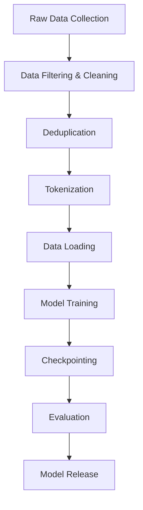

# Pretraining Large Language Models

Learn the complete process of pretraining LLMs from scratch, including dataset curation, training objectives, distributed training strategies, and practical considerations for training at scale.

## 🎯 Learning Objectives

By the end of this module, you will understand:
- Dataset curation and preprocessing for LLMs
- Pretraining objectives (CLM, MLM, denoising)
- Distributed training strategies (DDP, FSDP, pipeline parallelism)
- Checkpointing and recovery strategies
- Monitoring and debugging large-scale training
- Cost optimization and resource management

## 📚 Table of Contents

1. [The Pretraining Pipeline](#1-the-pretraining-pipeline)
2. [Dataset Curation](#2-dataset-curation)
3. [Data Processing and Tokenization](#3-data-processing-and-tokenization)
4. [Training Objectives](#4-training-objectives)
5. [Distributed Training](#5-distributed-training)
6. [Infrastructure and Scaling](#6-infrastructure-and-scaling)
7. [Monitoring and Debugging](#7-monitoring-and-debugging)
8. [Best Practices](#8-best-practices)

## 1. The Pretraining Pipeline

### 1.1 Overview



### 1.2 Key Components

1. **Data Pipeline**: Collecting, cleaning, and preparing training data
2. **Training Infrastructure**: GPUs/TPUs, networking, storage
3. **Model Architecture**: Choosing and configuring the model
4. **Training Loop**: Distributed training, optimization, monitoring
5. **Evaluation**: Validation, benchmarking, safety testing

## 2. Dataset Curation

### 2.1 Data Sources

**Common sources for LLM pretraining**:
- **Web Crawls**: Common Crawl, C4, RefinedWeb
- **Books**: BookCorpus, Gutenberg
- **Academic**: ArXiv, PubMed
- **Code**: GitHub, Stack Overflow
- **Reference**: Wikipedia, WikiBooks
- **News**: News articles, blogs

### 2.2 Quality Filtering

```python
def quality_filter(text):
    """Basic quality filtering for pretraining data."""
    # Length filter
    if len(text.split()) < 50 or len(text.split()) > 10000:
        return False
    
    # Language detection
    if detect_language(text) != 'en':
        return False
    
    # Perplexity filter (using small LM)
    if compute_perplexity(text) > threshold:
        return False
    
    # Repetition filter
    if has_excessive_repetition(text):
        return False
    
    # Adult content filter
    if contains_adult_content(text):
        return False
    
    return True
```

### 2.3 Deduplication

**Exact deduplication**:
```python
# Using MinHash for scalable deduplication
from datasketch import MinHash

def create_minhash(text, num_perm=128):
    m = MinHash(num_perm=num_perm)
    for word in text.split():
        m.update(word.encode('utf8'))
    return m

# Fuzzy deduplication
def fuzzy_dedup(documents, threshold=0.8):
    unique_docs = []
    signatures = []
    
    for doc in documents:
        minhash = create_minhash(doc)
        
        # Check similarity with existing documents
        is_duplicate = False
        for existing_sig in signatures:
            if minhash.jaccard(existing_sig) > threshold:
                is_duplicate = True
                break
        
        if not is_duplicate:
            unique_docs.append(doc)
            signatures.append(minhash)
    
    return unique_docs
```

### 2.4 Dataset Composition

| Dataset | Size | Weight | Description |
|---------|------|--------|-------------|
| Web Text | 45% | 0.45 | Filtered web pages |
| Books | 15% | 0.30 | Published books |
| Wikipedia | 5% | 0.15 | Encyclopedia articles |
| Code | 15% | 0.20 | GitHub repositories |
| Academic | 10% | 0.15 | Scientific papers |
| News | 10% | 0.10 | News articles |

## 3. Data Processing and Tokenization

### 3.1 Text Preprocessing

```python
def preprocess_text(text):
    """Preprocess text for LLM training."""
    # Normalize whitespace
    text = ' '.join(text.split())
    
    # Fix encoding issues
    text = fix_text_encoding(text)
    
    # Remove or escape special tokens
    text = text.replace('<|endoftext|>', '')
    
    # Normalize quotes and punctuation
    text = normalize_punctuation(text)
    
    return text
```

### 3.2 Efficient Tokenization

```python
from multiprocessing import Pool
import numpy as np

def tokenize_dataset(texts, tokenizer, max_length=2048):
    """Tokenize dataset with padding and truncation."""
    
    def tokenize_batch(batch):
        return tokenizer(
            batch,
            max_length=max_length,
            truncation=True,
            padding='max_length',
            return_tensors='np'
        )
    
    # Parallel tokenization
    with Pool() as pool:
        batches = [texts[i:i+1000] for i in range(0, len(texts), 1000)]
        tokenized_batches = pool.map(tokenize_batch, batches)
    
    # Concatenate results
    input_ids = np.concatenate([b['input_ids'] for b in tokenized_batches])
    attention_mask = np.concatenate([b['attention_mask'] for b in tokenized_batches])
    
    return input_ids, attention_mask
```

### 3.3 Data Format

**Standard format for pretraining**:
```python
# Document packing for efficiency
def pack_documents(tokenized_docs, max_length=2048):
    """Pack multiple documents into single training examples."""
    packed_examples = []
    current_example = []
    current_length = 0
    
    for doc in tokenized_docs:
        doc_length = len(doc)
        
        if current_length + doc_length <= max_length:
            current_example.extend(doc)
            current_length += doc_length
        else:
            # Pad and save current example
            padding = [pad_token_id] * (max_length - current_length)
            packed_examples.append(current_example + padding)
            
            # Start new example
            current_example = doc[:max_length]
            current_length = len(current_example)
    
    return packed_examples
```

## 4. Training Objectives

### 4.1 Causal Language Modeling (CLM)

**Standard autoregressive objective**:
```python
def clm_loss(logits, labels, ignore_index=-100):
    """Causal language modeling loss."""
    # Shift so that tokens < n predict n
    shift_logits = logits[..., :-1, :].contiguous()
    shift_labels = labels[..., 1:].contiguous()
    
    # Flatten the tokens
    loss = F.cross_entropy(
        shift_logits.view(-1, shift_logits.size(-1)),
        shift_labels.view(-1),
        ignore_index=ignore_index
    )
    
    return loss
```

### 4.2 Masked Language Modeling (MLM)

**BERT-style objective**:
```python
def mlm_loss(model, input_ids, attention_mask, mlm_probability=0.15):
    """Masked language modeling loss."""
    # Create masks
    labels = input_ids.clone()
    probability_matrix = torch.full(labels.shape, mlm_probability)
    masked_indices = torch.bernoulli(probability_matrix).bool()
    
    # Don't mask special tokens
    special_tokens_mask = get_special_tokens_mask(input_ids)
    masked_indices = masked_indices & ~special_tokens_mask
    
    # Replace masked tokens
    input_ids[masked_indices] = tokenizer.mask_token_id
    
    # Only compute loss on masked tokens
    labels[~masked_indices] = -100
    
    outputs = model(input_ids, attention_mask=attention_mask, labels=labels)
    return outputs.loss
```

### 4.3 Prefix Language Modeling

**Combining bidirectional and causal**:
```python
def prefix_lm_loss(model, input_ids, prefix_length):
    """Prefix LM objective (T5-style)."""
    # First prefix_length tokens can attend bidirectionally
    # Remaining tokens use causal mask
    
    attention_mask = create_prefix_lm_mask(
        input_ids.shape[1], 
        prefix_length
    )
    
    outputs = model(
        input_ids, 
        attention_mask=attention_mask,
        labels=input_ids
    )
    
    return outputs.loss
```

## 5. Distributed Training

### 5.1 Data Parallel Training

**Using PyTorch DDP**:
```python
import torch.distributed as dist
from torch.nn.parallel import DistributedDataParallel as DDP

def setup_ddp(rank, world_size):
    """Initialize DDP."""
    dist.init_process_group("nccl", rank=rank, world_size=world_size)
    torch.cuda.set_device(rank)

def train_ddp(rank, world_size, model, dataset):
    setup_ddp(rank, world_size)
    
    # Wrap model
    model = model.to(rank)
    model = DDP(model, device_ids=[rank])
    
    # Distributed sampler
    sampler = DistributedSampler(dataset, num_replicas=world_size, rank=rank)
    dataloader = DataLoader(dataset, sampler=sampler, batch_size=batch_size)
    
    # Training loop
    for epoch in range(num_epochs):
        sampler.set_epoch(epoch)  # Shuffle differently each epoch
        
        for batch in dataloader:
            loss = model(batch)
            loss.backward()
            optimizer.step()
```

### 5.2 Fully Sharded Data Parallel (FSDP)

**For very large models**:
```python
from torch.distributed.fsdp import FullyShardedDataParallel as FSDP
from torch.distributed.fsdp.wrap import transformer_auto_wrap_policy

def setup_fsdp(model, min_num_params=1e8):
    """Setup FSDP for large model training."""
    auto_wrap_policy = partial(
        transformer_auto_wrap_policy,
        transformer_layer_cls={TransformerBlock},
    )
    
    model = FSDP(
        model,
        auto_wrap_policy=auto_wrap_policy,
        mixed_precision=mixed_precision_policy,
        sharding_strategy=ShardingStrategy.FULL_SHARD,
        cpu_offload=CPUOffload(offload_params=True),
        backward_prefetch=BackwardPrefetch.BACKWARD_PRE,
        limit_all_gathers=True,
    )
    
    return model
```

### 5.3 Pipeline Parallelism

```python
from torch.distributed.pipeline.sync import Pipe

def create_pipeline_model(model, balance, devices):
    """Split model across devices for pipeline parallelism."""
    # Split model into stages
    stages = []
    layer_idx = 0
    
    for stage_layers in balance:
        stage = nn.Sequential()
        for _ in range(stage_layers):
            stage.add_module(f'layer_{layer_idx}', model.layers[layer_idx])
            layer_idx += 1
        stages.append(stage)
    
    # Create pipeline
    model = Pipe(
        nn.Sequential(*stages),
        balance=balance,
        devices=devices,
        chunks=8  # Micro-batches
    )
    
    return model
```

## 6. Infrastructure and Scaling

### 6.1 Hardware Requirements

| Model Size | GPUs Required | Memory/GPU | Interconnect |
|------------|--------------|------------|--------------|
| 7B | 8 x V100 | 32GB | NVLink |
| 13B | 16 x V100 | 32GB | NVLink |
| 30B | 32 x A100 | 40GB | NVLink |
| 65B | 64 x A100 | 80GB | InfiniBand |
| 175B | 128 x A100 | 80GB | InfiniBand |

### 6.2 Checkpointing Strategy

```python
class CheckpointManager:
    """Manage model checkpoints during training."""
    
    def __init__(self, save_dir, keep_last_n=5):
        self.save_dir = save_dir
        self.keep_last_n = keep_last_n
        self.checkpoints = []
        
    def save(self, model, optimizer, epoch, step, metrics):
        """Save checkpoint."""
        checkpoint = {
            'epoch': epoch,
            'step': step,
            'model_state_dict': model.state_dict(),
            'optimizer_state_dict': optimizer.state_dict(),
            'metrics': metrics,
            'rng_state': torch.get_rng_state(),
            'cuda_rng_state': torch.cuda.get_rng_state_all(),
        }
        
        path = f"{self.save_dir}/checkpoint_step_{step}.pt"
        torch.save(checkpoint, path)
        self.checkpoints.append(path)
        
        # Remove old checkpoints
        if len(self.checkpoints) > self.keep_last_n:
            old_checkpoint = self.checkpoints.pop(0)
            os.remove(old_checkpoint)
            
    def load_latest(self):
        """Load the latest checkpoint."""
        if not self.checkpoints:
            return None
            
        latest = self.checkpoints[-1]
        return torch.load(latest)
```

### 6.3 Mixed Precision Training

```python
from torch.cuda.amp import autocast, GradScaler

def train_with_amp(model, dataloader, optimizer):
    """Training with automatic mixed precision."""
    scaler = GradScaler()
    
    for batch in dataloader:
        optimizer.zero_grad()
        
        # Mixed precision forward pass
        with autocast():
            outputs = model(**batch)
            loss = outputs.loss
            
        # Scaled backward pass
        scaler.scale(loss).backward()
        
        # Gradient clipping
        scaler.unscale_(optimizer)
        torch.nn.utils.clip_grad_norm_(model.parameters(), max_grad_norm)
        
        # Optimizer step
        scaler.step(optimizer)
        scaler.update()
```

## 7. Monitoring and Debugging

### 7.1 Training Metrics

```python
class TrainingMonitor:
    """Monitor training progress and health."""
    
    def __init__(self):
        self.metrics = defaultdict(list)
        
    def log(self, step, loss, learning_rate, grad_norm, tokens_per_second):
        """Log training metrics."""
        self.metrics['step'].append(step)
        self.metrics['loss'].append(loss)
        self.metrics['learning_rate'].append(learning_rate)
        self.metrics['grad_norm'].append(grad_norm)
        self.metrics['tokens_per_second'].append(tokens_per_second)
        
        # Check for anomalies
        if math.isnan(loss) or loss > 10:
            logger.warning(f"Loss spike detected: {loss}")
            
        if grad_norm > 10:
            logger.warning(f"Large gradient norm: {grad_norm}")
            
    def plot_metrics(self):
        """Plot training curves."""
        fig, axes = plt.subplots(2, 2, figsize=(12, 8))
        
        # Loss curve
        axes[0, 0].plot(self.metrics['step'], self.metrics['loss'])
        axes[0, 0].set_title('Training Loss')
        axes[0, 0].set_yscale('log')
        
        # Learning rate
        axes[0, 1].plot(self.metrics['step'], self.metrics['learning_rate'])
        axes[0, 1].set_title('Learning Rate')
        
        # Gradient norm
        axes[1, 0].plot(self.metrics['step'], self.metrics['grad_norm'])
        axes[1, 0].set_title('Gradient Norm')
        axes[1, 0].set_yscale('log')
        
        # Throughput
        axes[1, 1].plot(self.metrics['step'], self.metrics['tokens_per_second'])
        axes[1, 1].set_title('Training Throughput')
        
        plt.tight_layout()
        plt.savefig('training_metrics.png')
```

### 7.2 Validation During Training

```python
def validate_during_training(model, val_dataloader, step):
    """Run validation during training."""
    model.eval()
    total_loss = 0
    total_tokens = 0
    
    with torch.no_grad():
        for batch in val_dataloader:
            outputs = model(**batch)
            total_loss += outputs.loss.item() * batch['input_ids'].numel()
            total_tokens += batch['input_ids'].numel()
            
    val_perplexity = math.exp(total_loss / total_tokens)
    
    # Log to wandb/tensorboard
    wandb.log({
        'val/loss': total_loss / total_tokens,
        'val/perplexity': val_perplexity,
        'step': step
    })
    
    model.train()
    return val_perplexity
```

## 8. Best Practices

### 8.1 Training Recipe

1. **Start Small**: Debug with small model and data
2. **Data Quality**: Invest heavily in data curation
3. **Stable Training**: Conservative LR, gradient clipping
4. **Regular Validation**: Monitor overfitting
5. **Checkpointing**: Save frequently, test recovery
6. **Monitoring**: Track everything, automate alerts

### 8.2 Common Issues and Solutions

| Issue | Symptoms | Solutions |
|-------|----------|-----------|
| Loss explosion | NaN loss, huge gradients | Lower LR, increase warmup, check data |
| Slow convergence | High loss plateau | Increase LR, check data distribution |
| OOM errors | CUDA out of memory | Gradient checkpointing, smaller batch, FSDP |
| Divergence | Loss increases | Reduce LR, check for bad data |
| Hardware failures | Training crashes | Regular checkpointing, redundancy |

### 8.3 Cost Optimization

```python
def estimate_training_cost(model_size, tokens, gpu_type='A100'):
    """Estimate training cost in GPU hours."""
    # Approximations based on empirical data
    flops_per_token = 6 * model_size  # 6x model parameters
    
    gpu_flops = {
        'V100': 125e12,  # 125 TFLOPS
        'A100': 312e12,  # 312 TFLOPS
        'H100': 1000e12  # 1000 TFLOPS
    }
    
    utilization = 0.3  # Typical MFU (Model FLOPS Utilization)
    effective_flops = gpu_flops[gpu_type] * utilization
    
    total_flops = flops_per_token * tokens
    gpu_hours = total_flops / effective_flops / 3600
    
    return gpu_hours
```

## 📊 Training Timeline Example

**7B Parameter Model**:
- Week 1-2: Data collection and preprocessing
- Week 3: Infrastructure setup and testing
- Week 4-8: Main training run
- Week 9: Evaluation and benchmarking
- Week 10: Model release preparation

## 🔍 Key Takeaways

1. **Data is King**: Quality > Quantity for pretraining
2. **Infrastructure Matters**: Reliable hardware and networking crucial
3. **Monitoring Essential**: Track everything, automate recovery
4. **Distributed Training**: FSDP for large models, DDP for smaller
5. **Checkpointing**: Frequent saves prevent lost compute
6. **Validation**: Regular perplexity checks catch issues early

## 📝 Summary

Pretraining LLMs requires:
- **Massive datasets**: Terabytes of curated text
- **Distributed infrastructure**: 100s of GPUs working together
- **Robust pipelines**: Handle failures gracefully
- **Careful monitoring**: Catch issues before they waste compute
- **Patience**: Weeks to months of training time

The investment is significant, but the resulting models power countless applications!

## ➡️ Next Steps

Ready to adapt pretrained models for specific tasks? Head to [Topic 11: Fine-tuning and Adaptation](../11-fine-tuning-adaptation/) to learn about efficient fine-tuning methods!