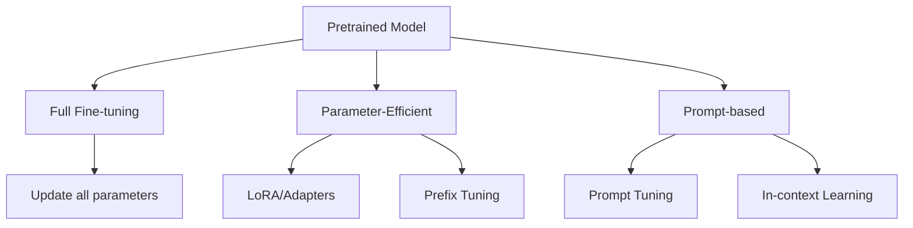

# Fine-tuning and Adaptation

Master the art of adapting pretrained language models for specific tasks, from traditional fine-tuning to modern parameter-efficient methods like LoRA and prompt tuning.

## 🎯 Learning Objectives

By the end of this module, you will understand:
- Full fine-tuning vs parameter-efficient methods
- LoRA, QLoRA, and adapter modules
- Prompt tuning and prefix tuning
- Instruction tuning and RLHF
- Multi-task fine-tuning strategies
- Best practices for different scenarios

## 📚 Table of Contents

1. [Fine-tuning Fundamentals](#1-fine-tuning-fundamentals)
2. [Full Fine-tuning](#2-full-fine-tuning)
3. [Parameter-Efficient Fine-Tuning (PEFT)](#3-parameter-efficient-fine-tuning-peft)
4. [LoRA and Variants](#4-lora-and-variants)
5. [Prompt-based Methods](#5-prompt-based-methods)
6. [Instruction Tuning](#6-instruction-tuning)
7. [RLHF and Alignment](#7-rlhf-and-alignment)
8. [Advanced Techniques](#8-advanced-techniques)

## 1. Fine-tuning Fundamentals

### 1.1 Why Fine-tune?

Pretrained models are great generalists, but fine-tuning allows:
- **Task Specialization**: Better performance on specific tasks
- **Domain Adaptation**: Adapt to specialized vocabulary/style
- **Behavior Alignment**: Make models follow instructions
- **Efficiency**: Smaller models can match larger ones on specific tasks

### 1.2 Fine-tuning Paradigms



### 1.3 When to Use Each Method

| Method | Parameters Updated | Use Case | Memory Required |
|--------|-------------------|----------|-----------------|
| Full Fine-tuning | All | Small models, ample resources | High |
| LoRA | <1% | Large models, limited resources | Low |
| Prefix Tuning | <0.1% | Very large models | Very Low |
| Prompt Tuning | <0.01% | Massive models, multiple tasks | Minimal |
| In-context | 0 | No training needed | None |

## 2. Full Fine-tuning

### 2.1 Standard Fine-tuning Pipeline

```python
from transformers import AutoModelForSequenceClassification, Trainer

def full_finetune(model_name, train_dataset, eval_dataset, num_labels=2):
    """Standard full fine-tuning pipeline."""
    
    # Load pretrained model
    model = AutoModelForSequenceClassification.from_pretrained(
        model_name,
        num_labels=num_labels
    )
    
    # Training arguments
    training_args = TrainingArguments(
        output_dir="./results",
        num_train_epochs=3,
        per_device_train_batch_size=16,
        per_device_eval_batch_size=64,
        warmup_steps=500,
        weight_decay=0.01,
        logging_dir="./logs",
        evaluation_strategy="epoch",
        save_strategy="epoch",
        load_best_model_at_end=True,
    )
    
    # Create trainer
    trainer = Trainer(
        model=model,
        args=training_args,
        train_dataset=train_dataset,
        eval_dataset=eval_dataset,
        compute_metrics=compute_metrics,
    )
    
    # Train
    trainer.train()
    
    return model
```

### 2.2 Learning Rate Scheduling

```python
def get_fine_tuning_scheduler(optimizer, num_training_steps, warmup_ratio=0.1):
    """Create fine-tuning learning rate schedule."""
    
    warmup_steps = int(num_training_steps * warmup_ratio)
    
    def lr_lambda(current_step):
        # Linear warmup
        if current_step < warmup_steps:
            return float(current_step) / float(max(1, warmup_steps))
        
        # Cosine decay
        progress = (current_step - warmup_steps) / (num_training_steps - warmup_steps)
        return 0.5 * (1.0 + math.cos(math.pi * progress))
    
    return LambdaLR(optimizer, lr_lambda)
```

### 2.3 Layer-wise Learning Rates

```python
def get_layer_wise_optimizer(model, base_lr=2e-5, decay_factor=0.95):
    """Different learning rates for different layers."""
    
    # Group parameters by layer
    parameters = []
    prev_layer_name = ""
    
    for name, param in model.named_parameters():
        layer_name = name.split('.')[0]
        
        if layer_name != prev_layer_name:
            # New layer group
            layer_id = len(parameters)
            parameters.append({
                'params': [],
                'lr': base_lr * (decay_factor ** layer_id)
            })
            prev_layer_name = layer_name
            
        parameters[-1]['params'].append(param)
    
    # Create optimizer with parameter groups
    optimizer = torch.optim.AdamW(parameters)
    
    return optimizer
```

## 3. Parameter-Efficient Fine-Tuning (PEFT)

### 3.1 Adapter Modules

```python
class AdapterModule(nn.Module):
    """Adapter module for parameter-efficient fine-tuning."""
    
    def __init__(self, hidden_size, adapter_size=64):
        super().__init__()
        self.down_project = nn.Linear(hidden_size, adapter_size)
        self.activation = nn.ReLU()
        self.up_project = nn.Linear(adapter_size, hidden_size)
        
        # Initialize with near-identity
        nn.init.normal_(self.down_project.weight, std=0.01)
        nn.init.zeros_(self.down_project.bias)
        nn.init.normal_(self.up_project.weight, std=0.01)
        nn.init.zeros_(self.up_project.bias)
        
    def forward(self, x):
        return x + self.up_project(self.activation(self.down_project(x)))


class TransformerWithAdapters(nn.Module):
    """Add adapters to transformer layers."""
    
    def __init__(self, base_model, adapter_size=64):
        super().__init__()
        self.base_model = base_model
        
        # Freeze base model
        for param in self.base_model.parameters():
            param.requires_grad = False
            
        # Add adapters
        self.adapters = nn.ModuleList([
            AdapterModule(base_model.config.hidden_size, adapter_size)
            for _ in range(base_model.config.num_hidden_layers)
        ])
        
    def forward(self, input_ids, attention_mask=None):
        # Get base model hidden states
        outputs = self.base_model(input_ids, attention_mask, output_hidden_states=True)
        hidden_states = outputs.hidden_states
        
        # Apply adapters
        adapted_states = []
        for i, (hidden, adapter) in enumerate(zip(hidden_states[1:], self.adapters)):
            adapted = adapter(hidden)
            adapted_states.append(adapted)
            
        return adapted_states[-1]
```

### 3.2 BitFit: Bias-only Fine-tuning

```python
def apply_bitfit(model):
    """Only fine-tune bias parameters."""
    for name, param in model.named_parameters():
        if 'bias' not in name:
            param.requires_grad = False
        else:
            param.requires_grad = True
    
    # Count trainable parameters
    trainable = sum(p.numel() for p in model.parameters() if p.requires_grad)
    total = sum(p.numel() for p in model.parameters())
    
    print(f"BitFit: Training {trainable:,} / {total:,} parameters ({trainable/total*100:.2f}%)")
    
    return model
```

## 4. LoRA and Variants

### 4.1 LoRA (Low-Rank Adaptation)

```python
class LoRALayer(nn.Module):
    """LoRA layer implementation."""
    
    def __init__(self, in_features, out_features, rank=16, alpha=16):
        super().__init__()
        self.rank = rank
        self.alpha = alpha
        self.scaling = alpha / rank
        
        # Low-rank matrices
        self.lora_A = nn.Parameter(torch.randn(in_features, rank))
        self.lora_B = nn.Parameter(torch.zeros(rank, out_features))
        
        # Initialize
        nn.init.kaiming_uniform_(self.lora_A, a=math.sqrt(5))
        
    def forward(self, x):
        # Low-rank update: x @ A @ B * scaling
        return x @ self.lora_A @ self.lora_B * self.scaling


def add_lora_to_model(model, rank=16, alpha=16, target_modules=['q_proj', 'v_proj']):
    """Add LoRA layers to specific modules."""
    
    for name, module in model.named_modules():
        if any(target in name for target in target_modules):
            if isinstance(module, nn.Linear):
                # Get dimensions
                in_features = module.in_features
                out_features = module.out_features
                
                # Create LoRA layer
                lora_layer = LoRALayer(in_features, out_features, rank, alpha)
                
                # Replace forward method
                original_forward = module.forward
                
                def new_forward(x):
                    return original_forward(x) + lora_layer(x)
                
                module.forward = new_forward
                
    return model
```

### 4.2 QLoRA: Quantized LoRA

```python
import bitsandbytes as bnb

def prepare_model_for_qlora(model_name):
    """Prepare model for QLoRA training."""
    
    # Load model in 4-bit
    bnb_config = BitsAndBytesConfig(
        load_in_4bit=True,
        bnb_4bit_quant_type="nf4",
        bnb_4bit_compute_dtype=torch.bfloat16,
        bnb_4bit_use_double_quant=True,
    )
    
    model = AutoModelForCausalLM.from_pretrained(
        model_name,
        quantization_config=bnb_config,
        device_map="auto",
    )
    
    # Prepare for training
    model = prepare_model_for_kbit_training(model)
    
    # Add LoRA
    config = LoraConfig(
        r=16,
        lora_alpha=32,
        target_modules=["q_proj", "v_proj", "k_proj", "o_proj"],
        lora_dropout=0.1,
        bias="none",
        task_type="CAUSAL_LM",
    )
    
    model = get_peft_model(model, config)
    
    return model
```

### 4.3 LoRA Variants

**DoRA (Weight-Decomposed LoRA)**:
```python
class DoRALayer(nn.Module):
    """DoRA: Decompose weight into magnitude and direction."""
    
    def __init__(self, in_features, out_features, rank=16):
        super().__init__()
        self.magnitude = nn.Parameter(torch.ones(out_features))
        self.lora_A = nn.Parameter(torch.randn(in_features, rank))
        self.lora_B = nn.Parameter(torch.zeros(rank, out_features))
        
    def forward(self, x, base_weight):
        # Decompose base weight
        base_norm = base_weight.norm(dim=0, keepdim=True)
        base_direction = base_weight / base_norm
        
        # Apply LoRA to direction
        lora_direction = self.lora_A @ self.lora_B
        new_direction = base_direction + lora_direction
        new_direction = new_direction / new_direction.norm(dim=0, keepdim=True)
        
        # Combine with magnitude
        new_weight = self.magnitude * new_direction
        
        return x @ new_weight
```

## 5. Prompt-based Methods

### 5.1 Soft Prompt Tuning

```python
class SoftPromptModel(nn.Module):
    """Soft prompt tuning implementation."""
    
    def __init__(self, base_model, n_prompt_tokens=20):
        super().__init__()
        self.base_model = base_model
        self.n_prompt_tokens = n_prompt_tokens
        
        # Freeze base model
        for param in self.base_model.parameters():
            param.requires_grad = False
            
        # Learnable prompt embeddings
        self.prompt_embeddings = nn.Parameter(
            torch.randn(n_prompt_tokens, base_model.config.hidden_size)
        )
        
    def forward(self, input_ids, attention_mask):
        batch_size = input_ids.shape[0]
        
        # Get input embeddings
        inputs_embeds = self.base_model.get_input_embeddings()(input_ids)
        
        # Expand prompt embeddings for batch
        prompt_embeds = self.prompt_embeddings.unsqueeze(0).expand(batch_size, -1, -1)
        
        # Concatenate prompt with input
        inputs_embeds = torch.cat([prompt_embeds, inputs_embeds], dim=1)
        
        # Update attention mask
        prompt_mask = torch.ones(batch_size, self.n_prompt_tokens).to(attention_mask.device)
        attention_mask = torch.cat([prompt_mask, attention_mask], dim=1)
        
        # Forward through model
        outputs = self.base_model(inputs_embeds=inputs_embeds, attention_mask=attention_mask)
        
        return outputs
```

### 5.2 Prefix Tuning

```python
class PrefixTuningModel(nn.Module):
    """Prefix tuning for encoder-decoder models."""
    
    def __init__(self, base_model, prefix_length=20):
        super().__init__()
        self.base_model = base_model
        self.prefix_length = prefix_length
        
        # Freeze base model
        for param in self.base_model.parameters():
            param.requires_grad = False
            
        # Prefix parameters for each layer
        config = base_model.config
        self.prefix_tokens = nn.Parameter(torch.randn(prefix_length, config.hidden_size))
        
        # Reparameterization networks
        self.prefix_mlp = nn.Sequential(
            nn.Linear(config.hidden_size, config.hidden_size * 2),
            nn.Tanh(),
            nn.Linear(config.hidden_size * 2, config.num_hidden_layers * 2 * config.hidden_size)
        )
        
    def forward(self, input_ids, attention_mask):
        batch_size = input_ids.shape[0]
        
        # Generate prefix key-values
        prefix_outputs = self.prefix_mlp(self.prefix_tokens)
        prefix_outputs = prefix_outputs.view(
            self.prefix_length,
            self.base_model.config.num_hidden_layers,
            2,
            self.base_model.config.hidden_size
        )
        
        # Split into keys and values
        prefix_keys = prefix_outputs[:, :, 0, :]
        prefix_values = prefix_outputs[:, :, 1, :]
        
        # Expand for batch
        prefix_keys = prefix_keys.unsqueeze(0).expand(batch_size, -1, -1, -1)
        prefix_values = prefix_values.unsqueeze(0).expand(batch_size, -1, -1, -1)
        
        # Forward with prefix
        outputs = self.base_model(
            input_ids=input_ids,
            attention_mask=attention_mask,
            past_key_values=[(prefix_keys[:, :, i], prefix_values[:, :, i]) 
                           for i in range(self.base_model.config.num_hidden_layers)]
        )
        
        return outputs
```

## 6. Instruction Tuning

### 6.1 Instruction Dataset Format

```python
def format_instruction_data(instruction, input_text, output_text):
    """Format data for instruction tuning."""
    
    # Common templates
    templates = {
        'alpaca': """Below is an instruction that describes a task. Write a response that appropriately completes the request.

### Instruction:
{instruction}

### Input:
{input}

### Response:
{output}""",
        
        'vicuna': """USER: {instruction}
{input}
ASSISTANT: {output}""",
        
        'openai': """<|im_start|>system
You are a helpful assistant.
<|im_end|>
<|im_start|>user
{instruction}
{input}
<|im_end|>
<|im_start|>assistant
{output}
<|im_end|>"""
    }
    
    return templates['alpaca'].format(
        instruction=instruction,
        input=input_text,
        output=output_text
    )
```

### 6.2 Instruction Tuning Pipeline

```python
def instruction_finetune(model, tokenizer, dataset, max_length=512):
    """Fine-tune model on instruction-following data."""
    
    def preprocess_function(examples):
        # Format instructions
        texts = []
        for inst, inp, out in zip(examples['instruction'], 
                                  examples['input'], 
                                  examples['output']):
            text = format_instruction_data(inst, inp, out)
            texts.append(text)
        
        # Tokenize
        model_inputs = tokenizer(
            texts,
            max_length=max_length,
            truncation=True,
            padding='max_length'
        )
        
        # Set up labels
        labels = model_inputs['input_ids'].copy()
        
        # Mask instruction part (only train on response)
        for i, text in enumerate(texts):
            response_start = text.find('### Response:') + len('### Response:\n')
            response_tokens_start = len(tokenizer.encode(text[:response_start]))
            labels[i][:response_tokens_start] = -100
            
        model_inputs['labels'] = labels
        
        return model_inputs
    
    # Preprocess dataset
    tokenized_dataset = dataset.map(preprocess_function, batched=True)
    
    # Training
    trainer = Trainer(
        model=model,
        train_dataset=tokenized_dataset,
        args=TrainingArguments(
            output_dir="./instruction-tuned",
            num_train_epochs=3,
            per_device_train_batch_size=4,
            gradient_accumulation_steps=4,
            warmup_ratio=0.03,
            learning_rate=2e-5,
            fp16=True,
            logging_steps=10,
            save_strategy="epoch",
        ),
        data_collator=DataCollatorForLanguageModeling(tokenizer, mlm=False),
    )
    
    trainer.train()
    
    return model
```

## 7. RLHF and Alignment

### 7.1 Reward Modeling

```python
class RewardModel(nn.Module):
    """Reward model for RLHF."""
    
    def __init__(self, base_model):
        super().__init__()
        self.base_model = base_model
        self.reward_head = nn.Linear(base_model.config.hidden_size, 1)
        
    def forward(self, input_ids, attention_mask):
        outputs = self.base_model(input_ids, attention_mask)
        hidden_states = outputs.last_hidden_state
        
        # Pool last token (assumes padding on right)
        sequence_lengths = attention_mask.sum(dim=1) - 1
        pooled = hidden_states[torch.arange(hidden_states.size(0)), sequence_lengths]
        
        # Compute reward
        reward = self.reward_head(pooled)
        
        return reward
    
    def compute_loss(self, chosen_ids, rejected_ids, attention_mask):
        """Compute pairwise ranking loss."""
        chosen_rewards = self.forward(chosen_ids, attention_mask)
        rejected_rewards = self.forward(rejected_ids, attention_mask)
        
        # Ranking loss
        loss = -torch.log(torch.sigmoid(chosen_rewards - rejected_rewards)).mean()
        
        return loss
```

### 7.2 PPO Training

```python
from trl import PPOTrainer, PPOConfig

def rlhf_training(model, ref_model, reward_model, dataset):
    """RLHF training with PPO."""
    
    # PPO configuration
    ppo_config = PPOConfig(
        model_name="gpt2",
        learning_rate=1.41e-5,
        batch_size=128,
        mini_batch_size=4,
        gradient_accumulation_steps=1,
        optimize_cuda_cache=True,
        early_stopping=False,
        target_kl=6.0,
        ppo_epochs=4,
        seed=42,
    )
    
    # Create PPO trainer
    ppo_trainer = PPOTrainer(
        model=model,
        ref_model=ref_model,
        tokenizer=tokenizer,
        dataset=dataset,
        config=ppo_config,
    )
    
    # Training loop
    for epoch in range(10):
        for batch in tqdm(ppo_trainer.dataloader):
            query_tensors = batch["input_ids"]
            
            # Generate responses
            response_tensors = ppo_trainer.generate(
                query_tensors,
                max_new_tokens=128,
                do_sample=True,
                top_p=0.9,
                temperature=0.8,
            )
            
            # Compute rewards
            texts = [tokenizer.decode(r, skip_special_tokens=True) for r in response_tensors]
            rewards = [reward_model(t) for t in texts]
            
            # PPO step
            stats = ppo_trainer.step(query_tensors, response_tensors, rewards)
            ppo_trainer.log_stats(stats, batch, rewards)
            
    return model
```

### 7.3 DPO (Direct Preference Optimization)

```python
def dpo_loss(model, chosen_ids, rejected_ids, beta=0.1):
    """Direct Preference Optimization loss."""
    
    # Get log probabilities
    chosen_logits = model(chosen_ids).logits
    rejected_logits = model(rejected_ids).logits
    
    # Compute log probabilities
    chosen_logprobs = F.log_softmax(chosen_logits, dim=-1)
    rejected_logprobs = F.log_softmax(rejected_logits, dim=-1)
    
    # DPO loss
    logits_diff = beta * (chosen_logprobs.sum(dim=-1) - rejected_logprobs.sum(dim=-1))
    loss = -F.logsigmoid(logits_diff).mean()
    
    return loss
```

## 8. Advanced Techniques

### 8.1 Multi-Task Fine-tuning

```python
class MultiTaskModel(nn.Module):
    """Multi-task fine-tuning with task-specific heads."""
    
    def __init__(self, base_model, task_configs):
        super().__init__()
        self.base_model = base_model
        self.task_heads = nn.ModuleDict()
        
        for task_name, config in task_configs.items():
            if config['type'] == 'classification':
                head = nn.Linear(base_model.config.hidden_size, config['num_labels'])
            elif config['type'] == 'regression':
                head = nn.Linear(base_model.config.hidden_size, 1)
            elif config['type'] == 'generation':
                head = nn.Linear(base_model.config.hidden_size, base_model.config.vocab_size)
                
            self.task_heads[task_name] = head
            
    def forward(self, input_ids, attention_mask, task_name):
        # Shared encoding
        outputs = self.base_model(input_ids, attention_mask)
        hidden_states = outputs.last_hidden_state
        
        # Task-specific head
        task_output = self.task_heads[task_name](hidden_states)
        
        return task_output
```

### 8.2 Continual Learning

```python
class EWC:
    """Elastic Weight Consolidation for continual learning."""
    
    def __init__(self, model, dataset, importance=1000):
        self.model = model
        self.importance = importance
        self.params = {n: p.clone() for n, p in model.named_parameters()}
        self.fisher = self._compute_fisher(dataset)
        
    def _compute_fisher(self, dataset):
        """Compute Fisher Information Matrix."""
        fisher = {}
        
        for batch in dataset:
            self.model.zero_grad()
            output = self.model(**batch)
            loss = output.loss
            loss.backward()
            
            for name, param in self.model.named_parameters():
                if param.grad is not None:
                    if name not in fisher:
                        fisher[name] = param.grad.data.clone() ** 2
                    else:
                        fisher[name] += param.grad.data.clone() ** 2
                        
        # Average
        for name in fisher:
            fisher[name] /= len(dataset)
            
        return fisher
    
    def penalty(self):
        """Compute EWC penalty."""
        loss = 0
        for name, param in self.model.named_parameters():
            if name in self.fisher:
                loss += (self.fisher[name] * (param - self.params[name]) ** 2).sum()
                
        return self.importance * loss
```

### 8.3 Few-shot Fine-tuning

```python
def few_shot_finetune(model, support_set, query_set, steps=100):
    """Few-shot fine-tuning with meta-learning."""
    
    # Clone model for inner loop
    inner_model = copy.deepcopy(model)
    inner_optimizer = torch.optim.Adam(inner_model.parameters(), lr=1e-3)
    
    # Inner loop: adapt to support set
    for step in range(steps):
        support_loss = compute_loss(inner_model, support_set)
        inner_optimizer.zero_grad()
        support_loss.backward()
        inner_optimizer.step()
        
    # Evaluate on query set
    with torch.no_grad():
        query_loss = compute_loss(inner_model, query_set)
        
    # Outer loop: update original model
    meta_gradient = torch.autograd.grad(query_loss, model.parameters())
    
    return meta_gradient
```

## 📊 Method Comparison

| Method | Parameters | Memory | Speed | Quality | Use Case |
|--------|-----------|--------|-------|---------|----------|
| Full Fine-tuning | 100% | High | Slow | Best | Small models |
| LoRA | 0.1-1% | Low | Fast | Good | Large models |
| QLoRA | 0.1-1% | Very Low | Medium | Good | Very large models |
| Prefix Tuning | <0.1% | Minimal | Fast | Good | Multi-task |
| Prompt Tuning | <0.01% | Minimal | Very Fast | OK | Many tasks |
| Adapters | 1-5% | Low | Fast | Good | Domain adaptation |

## 🔍 Best Practices

1. **Start with LoRA**: Good balance of efficiency and performance
2. **Use QLoRA for large models**: 4-bit quantization saves memory
3. **Layer-wise learning rates**: Lower LR for earlier layers
4. **Mixed precision training**: FP16/BF16 for speed
5. **Gradient checkpointing**: Trade compute for memory
6. **Early stopping**: Monitor validation loss
7. **Learning rate warmup**: Critical for stability

## 📝 Summary

Fine-tuning and adaptation methods enable:
- **Efficient specialization**: Adapt large models with minimal resources
- **Multi-task capabilities**: Single model for many tasks
- **Continual learning**: Add capabilities without forgetting
- **Alignment**: Make models helpful, harmless, and honest

Choose the right method based on:
- Model size and available resources
- Number of tasks
- Performance requirements
- Deployment constraints

## ➡️ Next Steps

Ready to optimize models for production? Head to [Topic 12: Scaling and Optimization](../12-scaling-optimization/) to learn about model compression, quantization, and deployment strategies!