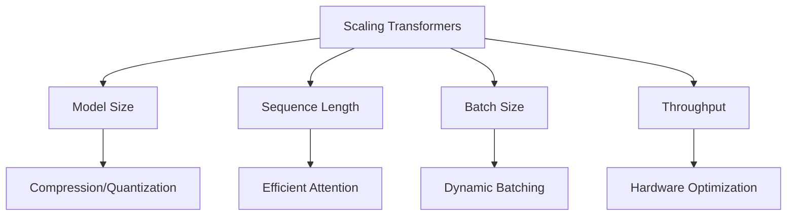

# Scaling and Optimization

Master techniques for scaling transformers efficiently, from model compression and quantization to optimized inference engines and hardware acceleration.

## 🎯 Learning Objectives

By the end of this module, you will understand:
- Model compression techniques (pruning, distillation)
- Quantization methods (INT8, INT4, mixed precision)
- Optimized attention mechanisms for long sequences
- Hardware acceleration (GPU, TPU, specialized chips)
- Deployment optimization strategies
- Serving at scale with batching and caching

## 📚 Table of Contents

1. [Scaling Challenges](#1-scaling-challenges)
2. [Model Compression](#2-model-compression)
3. [Quantization Techniques](#3-quantization-techniques)
4. [Attention Optimization](#4-attention-optimization)
5. [Hardware Acceleration](#5-hardware-acceleration)
6. [Deployment Strategies](#6-deployment-strategies)
7. [Serving Infrastructure](#7-serving-infrastructure)
8. [Performance Benchmarking](#8-performance-benchmarking)

## 1. Scaling Challenges

### 1.1 The Scaling Problem

As models grow, we face:
- **Memory constraints**: Models exceed GPU memory
- **Latency requirements**: Real-time applications need fast inference
- **Throughput demands**: Serving millions of requests
- **Cost pressures**: GPU hours are expensive
- **Energy consumption**: Environmental and operational costs

### 1.2 Scaling Dimensions



### 1.3 Performance Metrics

| Metric | Definition | Target |
|--------|-----------|--------|
| Latency | Time for single request | <100ms |
| Throughput | Requests per second | >1000 RPS |
| Memory | Model + activation memory | <GPU limit |
| Cost | $ per million tokens | <$0.01 |
| Quality | Task performance | >95% of original |

## 2. Model Compression

### 2.1 Knowledge Distillation

```python
class DistillationTrainer:
    """Knowledge distillation from teacher to student model."""
    
    def __init__(self, teacher_model, student_model, temperature=3.0, alpha=0.7):
        self.teacher = teacher_model
        self.student = student_model
        self.temperature = temperature
        self.alpha = alpha  # Weight for distillation loss
        
        # Freeze teacher
        for param in self.teacher.parameters():
            param.requires_grad = False
            
    def compute_distillation_loss(self, inputs, labels):
        """Compute combined task and distillation loss."""
        
        # Teacher outputs (no grad)
        with torch.no_grad():
            teacher_outputs = self.teacher(**inputs)
            teacher_logits = teacher_outputs.logits
            
        # Student outputs
        student_outputs = self.student(**inputs)
        student_logits = student_outputs.logits
        
        # Task loss
        task_loss = F.cross_entropy(student_logits, labels)
        
        # Distillation loss
        soft_targets = F.softmax(teacher_logits / self.temperature, dim=-1)
        soft_predictions = F.log_softmax(student_logits / self.temperature, dim=-1)
        distillation_loss = F.kl_div(soft_predictions, soft_targets, reduction='batchmean')
        distillation_loss *= self.temperature ** 2
        
        # Combined loss
        total_loss = self.alpha * distillation_loss + (1 - self.alpha) * task_loss
        
        return total_loss, task_loss, distillation_loss
```

### 2.2 Structured Pruning

```python
class StructuredPruning:
    """Prune entire attention heads or FFN dimensions."""
    
    def __init__(self, model, pruning_ratio=0.3):
        self.model = model
        self.pruning_ratio = pruning_ratio
        
    def compute_head_importance(self, dataloader):
        """Compute importance scores for attention heads."""
        head_importance = defaultdict(list)
        
        for batch in dataloader:
            with torch.no_grad():
                outputs = self.model(**batch, output_attentions=True)
                
            # Aggregate attention scores
            for layer_idx, attn in enumerate(outputs.attentions):
                # Average attention over all positions
                head_scores = attn.mean(dim=(0, 2, 3))  # [num_heads]
                head_importance[layer_idx].append(head_scores)
                
        # Average over dataset
        for layer_idx in head_importance:
            head_importance[layer_idx] = torch.stack(head_importance[layer_idx]).mean(0)
            
        return head_importance
    
    def prune_heads(self, head_importance):
        """Prune least important heads."""
        heads_to_prune = {}
        
        for layer_idx, importance in head_importance.items():
            # Find heads to prune
            num_heads = len(importance)
            num_to_prune = int(num_heads * self.pruning_ratio)
            
            # Get indices of least important heads
            _, indices = importance.sort()
            heads_to_prune[layer_idx] = indices[:num_to_prune].tolist()
            
        # Apply pruning
        self.model.prune_heads(heads_to_prune)
        
        return heads_to_prune
```

### 2.3 Layer Dropping

```python
class LayerDropModel(nn.Module):
    """Model with stochastic layer dropping during training."""
    
    def __init__(self, base_model, layer_drop_rate=0.1):
        super().__init__()
        self.base_model = base_model
        self.layer_drop_rate = layer_drop_rate
        
    def forward(self, input_ids, attention_mask=None):
        hidden_states = self.base_model.embeddings(input_ids)
        
        for layer in self.base_model.encoder.layer:
            # Stochastic layer dropping during training
            if self.training and torch.rand(1).item() < self.layer_drop_rate:
                continue
                
            # During inference, scale outputs
            if not self.training:
                layer_outputs = layer(hidden_states, attention_mask)
                hidden_states = layer_outputs[0] * (1 - self.layer_drop_rate)
            else:
                layer_outputs = layer(hidden_states, attention_mask)
                hidden_states = layer_outputs[0]
                
        return hidden_states
```

## 3. Quantization Techniques

### 3.1 Post-Training Quantization

```python
def quantize_model_int8(model):
    """Quantize model to INT8 using PyTorch."""
    
    # Prepare model for quantization
    model.eval()
    
    # Fuse modules (Conv-BN, Linear-ReLU, etc.)
    model = torch.quantization.fuse_modules(model, [['linear', 'relu']])
    
    # Specify quantization config
    model.qconfig = torch.quantization.get_default_qconfig('fbgemm')
    
    # Prepare model
    torch.quantization.prepare(model, inplace=True)
    
    # Calibrate with representative data
    def calibrate(model, dataloader):
        with torch.no_grad():
            for batch in dataloader:
                model(batch)
                
    calibrate(model, calibration_dataloader)
    
    # Convert to quantized model
    quantized_model = torch.quantization.convert(model, inplace=True)
    
    return quantized_model
```

### 3.2 Quantization-Aware Training (QAT)

```python
class QATModel(nn.Module):
    """Model with fake quantization for QAT."""
    
    def __init__(self, base_model, num_bits=8):
        super().__init__()
        self.base_model = base_model
        self.num_bits = num_bits
        
        # Add fake quantization modules
        self.quant = torch.quantization.QuantStub()
        self.dequant = torch.quantization.DeQuantStub()
        
    def forward(self, x):
        # Quantize inputs
        x = self.quant(x)
        
        # Forward through model
        x = self.base_model(x)
        
        # Dequantize outputs
        x = self.dequant(x)
        
        return x
    
    def prepare_qat(self):
        """Prepare model for QAT."""
        self.qconfig = torch.quantization.get_default_qat_qconfig('fbgemm')
        torch.quantization.prepare_qat(self, inplace=True)
        
    def convert_to_quantized(self):
        """Convert to actual quantized model."""
        self.eval()
        torch.quantization.convert(self, inplace=True)
```

### 3.3 Mixed Precision (INT8/INT4)

```python
class MixedPrecisionQuantization:
    """Different precision for different layers."""
    
    def __init__(self, model):
        self.model = model
        self.precision_config = {}
        
    def analyze_sensitivity(self, dataloader):
        """Analyze quantization sensitivity per layer."""
        sensitivity = {}
        
        for name, module in self.model.named_modules():
            if isinstance(module, nn.Linear):
                # Original output
                original_output = []
                
                def hook_fn(module, input, output):
                    original_output.append(output.clone())
                    
                handle = module.register_forward_hook(hook_fn)
                
                # Run inference
                with torch.no_grad():
                    for batch in dataloader:
                        _ = self.model(batch)
                        
                handle.remove()
                
                # Quantize module and measure difference
                quantized_module = self.quantize_module(module, bits=8)
                quantized_output = []
                
                handle = quantized_module.register_forward_hook(
                    lambda m, i, o: quantized_output.append(o.clone())
                )
                
                with torch.no_grad():
                    for batch in dataloader:
                        _ = self.model(batch)
                        
                handle.remove()
                
                # Compute sensitivity
                mse = sum((o - q).pow(2).mean().item() 
                         for o, q in zip(original_output, quantized_output))
                sensitivity[name] = mse / len(original_output)
                
        return sensitivity
    
    def apply_mixed_precision(self, sensitivity, threshold=0.01):
        """Apply different quantization based on sensitivity."""
        for name, score in sensitivity.items():
            if score < threshold:
                # Low sensitivity: use INT4
                self.precision_config[name] = 4
            elif score < threshold * 10:
                # Medium sensitivity: use INT8
                self.precision_config[name] = 8
            else:
                # High sensitivity: keep FP16
                self.precision_config[name] = 16
                
        return self.precision_config
```

## 4. Attention Optimization

### 4.1 Flash Attention Integration

```python
from flash_attn import flash_attn_func

class FlashAttentionLayer(nn.Module):
    """Attention layer using Flash Attention."""
    
    def __init__(self, hidden_size, num_heads, dropout=0.0):
        super().__init__()
        self.hidden_size = hidden_size
        self.num_heads = num_heads
        self.head_dim = hidden_size // num_heads
        
        self.qkv_proj = nn.Linear(hidden_size, 3 * hidden_size, bias=False)
        self.o_proj = nn.Linear(hidden_size, hidden_size, bias=False)
        self.dropout = dropout
        
    def forward(self, hidden_states, attention_mask=None):
        batch_size, seq_len = hidden_states.shape[:2]
        
        # QKV projection
        qkv = self.qkv_proj(hidden_states)
        qkv = qkv.reshape(batch_size, seq_len, 3, self.num_heads, self.head_dim)
        qkv = qkv.permute(2, 0, 1, 3, 4)  # [3, B, L, H, D]
        q, k, v = qkv[0], qkv[1], qkv[2]
        
        # Flash Attention
        if hidden_states.is_cuda:
            # Use Flash Attention kernel
            attn_output = flash_attn_func(
                q, k, v,
                dropout_p=self.dropout if self.training else 0.0,
                causal=True
            )
        else:
            # Fallback to standard attention
            attn_output = F.scaled_dot_product_attention(
                q.transpose(1, 2),
                k.transpose(1, 2),
                v.transpose(1, 2),
                dropout_p=self.dropout if self.training else 0.0,
                is_causal=True
            ).transpose(1, 2)
            
        # Reshape and project
        attn_output = attn_output.reshape(batch_size, seq_len, self.hidden_size)
        attn_output = self.o_proj(attn_output)
        
        return attn_output
```

### 4.2 Sparse Attention

```python
class SparseAttention(nn.Module):
    """Sparse attention patterns for long sequences."""
    
    def __init__(self, hidden_size, num_heads, sparsity_config):
        super().__init__()
        self.num_heads = num_heads
        self.head_dim = hidden_size // num_heads
        
        # Sparsity configuration
        self.local_window = sparsity_config.get('local_window', 256)
        self.num_global_tokens = sparsity_config.get('num_global_tokens', 8)
        
        self.qkv_proj = nn.Linear(hidden_size, 3 * hidden_size)
        self.o_proj = nn.Linear(hidden_size, hidden_size)
        
    def create_sparse_mask(self, seq_len):
        """Create sparse attention mask."""
        mask = torch.zeros(seq_len, seq_len)
        
        # Local attention window
        for i in range(seq_len):
            start = max(0, i - self.local_window // 2)
            end = min(seq_len, i + self.local_window // 2 + 1)
            mask[i, start:end] = 1
            
        # Global tokens attend to everything
        mask[:self.num_global_tokens, :] = 1
        mask[:, :self.num_global_tokens] = 1
        
        return mask.bool()
    
    def forward(self, hidden_states):
        batch_size, seq_len, _ = hidden_states.shape
        
        # QKV projection
        qkv = self.qkv_proj(hidden_states)
        q, k, v = qkv.chunk(3, dim=-1)
        
        # Reshape for multi-head attention
        q = q.view(batch_size, seq_len, self.num_heads, self.head_dim).transpose(1, 2)
        k = k.view(batch_size, seq_len, self.num_heads, self.head_dim).transpose(1, 2)
        v = v.view(batch_size, seq_len, self.num_heads, self.head_dim).transpose(1, 2)
        
        # Create sparse mask
        sparse_mask = self.create_sparse_mask(seq_len).to(hidden_states.device)
        
        # Compute sparse attention
        scores = torch.matmul(q, k.transpose(-2, -1)) / math.sqrt(self.head_dim)
        scores = scores.masked_fill(~sparse_mask.unsqueeze(0).unsqueeze(0), float('-inf'))
        
        attn_weights = F.softmax(scores, dim=-1)
        attn_output = torch.matmul(attn_weights, v)
        
        # Reshape and project
        attn_output = attn_output.transpose(1, 2).reshape(batch_size, seq_len, -1)
        attn_output = self.o_proj(attn_output)
        
        return attn_output
```

### 4.3 Multi-Query Attention Optimization

```python
class OptimizedMQA(nn.Module):
    """Optimized Multi-Query Attention for inference."""
    
    def __init__(self, hidden_size, num_heads):
        super().__init__()
        self.num_heads = num_heads
        self.head_dim = hidden_size // num_heads
        
        # Separate projections for better cache efficiency
        self.q_proj = nn.Linear(hidden_size, hidden_size, bias=False)
        self.kv_proj = nn.Linear(hidden_size, 2 * self.head_dim, bias=False)
        self.o_proj = nn.Linear(hidden_size, hidden_size, bias=False)
        
    def forward(self, hidden_states, past_kv=None, use_cache=True):
        batch_size, seq_len, _ = hidden_states.shape
        
        # Query projection
        q = self.q_proj(hidden_states)
        q = q.view(batch_size, seq_len, self.num_heads, self.head_dim).transpose(1, 2)
        
        # Key-Value projection (single head)
        kv = self.kv_proj(hidden_states)
        k, v = kv.chunk(2, dim=-1)
        k = k.unsqueeze(1)  # [B, 1, L, D]
        v = v.unsqueeze(1)  # [B, 1, L, D]
        
        # Use cache if available
        if past_kv is not None:
            past_k, past_v = past_kv
            k = torch.cat([past_k, k], dim=2)
            v = torch.cat([past_v, v], dim=2)
            
        # Expand for all heads
        k = k.expand(-1, self.num_heads, -1, -1)
        v = v.expand(-1, self.num_heads, -1, -1)
        
        # Attention computation
        scores = torch.matmul(q, k.transpose(-2, -1)) / math.sqrt(self.head_dim)
        
        # Causal mask
        if seq_len > 1:
            causal_mask = torch.triu(torch.ones(seq_len, k.shape[2]), diagonal=1).bool()
            scores = scores.masked_fill(causal_mask.to(scores.device), float('-inf'))
            
        attn_weights = F.softmax(scores, dim=-1)
        attn_output = torch.matmul(attn_weights, v)
        
        # Output projection
        attn_output = attn_output.transpose(1, 2).reshape(batch_size, seq_len, -1)
        attn_output = self.o_proj(attn_output)
        
        if use_cache:
            return attn_output, (k[:, 0:1], v[:, 0:1])  # Only return single KV head
        else:
            return attn_output
```

## 5. Hardware Acceleration

### 5.1 GPU Kernel Optimization

```python
import triton
import triton.language as tl

@triton.jit
def fused_attention_kernel(
    Q, K, V, Out,
    stride_qb, stride_qh, stride_qm,
    stride_kb, stride_kh, stride_kn,
    stride_vb, stride_vh, stride_vn,
    stride_ob, stride_oh, stride_om,
    nheads, seqlen,
    BLOCK_M: tl.constexpr,
    BLOCK_N: tl.constexpr,
):
    """Fused attention kernel using Triton."""
    
    # Program ID
    pid_b = tl.program_id(0)
    pid_h = tl.program_id(1)
    pid_m = tl.program_id(2)
    
    # Offsets
    offs_m = pid_m * BLOCK_M + tl.arange(0, BLOCK_M)
    offs_n = tl.arange(0, BLOCK_N)
    
    # Initialize accumulator
    acc = tl.zeros((BLOCK_M, BLOCK_N), dtype=tl.float32)
    
    # Compute attention scores
    for start_n in range(0, seqlen, BLOCK_N):
        # Load Q, K blocks
        q = tl.load(Q + pid_b * stride_qb + pid_h * stride_qh + offs_m[:, None] * stride_qm)
        k = tl.load(K + pid_b * stride_kb + pid_h * stride_kh + (start_n + offs_n[None, :]) * stride_kn)
        
        # Compute scores
        scores = tl.dot(q, k.trans())
        
        # Causal mask
        causal_mask = offs_m[:, None] >= (start_n + offs_n[None, :])
        scores = tl.where(causal_mask, scores, float('-inf'))
        
        # Softmax
        scores = tl.softmax(scores, axis=1)
        
        # Load V and accumulate
        v = tl.load(V + pid_b * stride_vb + pid_h * stride_vh + (start_n + offs_n[None, :]) * stride_vn)
        acc += tl.dot(scores, v)
        
    # Store output
    out_ptrs = Out + pid_b * stride_ob + pid_h * stride_oh + offs_m[:, None] * stride_om
    tl.store(out_ptrs, acc)
```

### 5.2 Tensor Parallelism

```python
class TensorParallelLinear(nn.Module):
    """Linear layer with tensor parallelism."""
    
    def __init__(self, in_features, out_features, world_size, rank):
        super().__init__()
        self.in_features = in_features
        self.out_features = out_features
        self.world_size = world_size
        self.rank = rank
        
        # Split output dimension across devices
        self.out_features_per_rank = out_features // world_size
        
        # Create local weight matrix
        self.weight = nn.Parameter(
            torch.empty(self.out_features_per_rank, in_features)
        )
        
        # Initialize
        nn.init.xavier_uniform_(self.weight)
        
    def forward(self, x):
        # Local computation
        local_output = F.linear(x, self.weight)
        
        # All-gather to combine results
        output_list = [torch.empty_like(local_output) for _ in range(self.world_size)]
        dist.all_gather(output_list, local_output)
        
        # Concatenate
        output = torch.cat(output_list, dim=-1)
        
        return output
```

### 5.3 CPU Optimization

```python
import torch.nn.functional as F
from torch import nn
import onnxruntime as ort

class CPUOptimizedModel:
    """Model optimized for CPU inference."""
    
    def __init__(self, model_path):
        # Create ONNX Runtime session
        providers = ['CPUExecutionProvider']
        
        # Optimization options
        sess_options = ort.SessionOptions()
        sess_options.graph_optimization_level = ort.GraphOptimizationLevel.ORT_ENABLE_ALL
        sess_options.intra_op_num_threads = 4
        sess_options.inter_op_num_threads = 1
        
        # Create session
        self.session = ort.InferenceSession(
            model_path,
            sess_options=sess_options,
            providers=providers
        )
        
        # Get input/output names
        self.input_name = self.session.get_inputs()[0].name
        self.output_name = self.session.get_outputs()[0].name
        
    def __call__(self, input_ids, attention_mask=None):
        # Prepare inputs
        ort_inputs = {
            self.input_name: input_ids.numpy(),
        }
        
        if attention_mask is not None:
            ort_inputs['attention_mask'] = attention_mask.numpy()
            
        # Run inference
        outputs = self.session.run([self.output_name], ort_inputs)
        
        return torch.from_numpy(outputs[0])
```

## 6. Deployment Strategies

### 6.1 Model Sharding

```python
class ModelSharding:
    """Shard large models across multiple GPUs."""
    
    def __init__(self, model, device_map):
        self.model = model
        self.device_map = device_map
        
        # Move layers to devices
        self.shard_model()
        
    def shard_model(self):
        """Distribute layers across devices."""
        for name, device in self.device_map.items():
            module = self.model.get_submodule(name)
            module.to(device)
            
            # Wrap with device transfer
            original_forward = module.forward
            
            def device_forward(x, *args, **kwargs):
                x = x.to(device)
                output = original_forward(x, *args, **kwargs)
                return output
                
            module.forward = device_forward
            
    def generate_device_map(self, num_devices):
        """Auto-generate device map based on memory usage."""
        device_map = {}
        current_device = 0
        current_memory = 0
        memory_limit = torch.cuda.get_device_properties(0).total_memory * 0.8
        
        for name, module in self.model.named_modules():
            if len(list(module.children())) > 0:
                continue  # Skip non-leaf modules
                
            # Estimate module memory
            module_memory = sum(p.numel() * p.element_size() for p in module.parameters())
            
            if current_memory + module_memory > memory_limit:
                current_device = (current_device + 1) % num_devices
                current_memory = 0
                
            device_map[name] = f'cuda:{current_device}'
            current_memory += module_memory
            
        return device_map
```

### 6.2 Dynamic Batching

```python
class DynamicBatchingServer:
    """Server with dynamic batching for optimal throughput."""
    
    def __init__(self, model, max_batch_size=32, max_wait_time=0.01):
        self.model = model
        self.max_batch_size = max_batch_size
        self.max_wait_time = max_wait_time
        
        self.request_queue = queue.Queue()
        self.result_futures = {}
        
    def add_request(self, input_ids, request_id):
        """Add request to queue."""
        future = Future()
        self.request_queue.put({
            'input_ids': input_ids,
            'request_id': request_id,
            'timestamp': time.time()
        })
        self.result_futures[request_id] = future
        return future
        
    def process_batch(self):
        """Process a batch of requests."""
        batch = []
        start_time = time.time()
        
        # Collect requests for batch
        while len(batch) < self.max_batch_size:
            try:
                timeout = self.max_wait_time - (time.time() - start_time)
                if timeout <= 0:
                    break
                    
                request = self.request_queue.get(timeout=timeout)
                batch.append(request)
            except queue.Empty:
                break
                
        if not batch:
            return
            
        # Pad inputs
        max_length = max(len(req['input_ids']) for req in batch)
        padded_inputs = []
        
        for req in batch:
            input_ids = req['input_ids']
            padding = [0] * (max_length - len(input_ids))
            padded_inputs.append(input_ids + padding)
            
        # Run inference
        batch_tensor = torch.tensor(padded_inputs)
        with torch.no_grad():
            outputs = self.model(batch_tensor)
            
        # Return results
        for i, req in enumerate(batch):
            result = outputs[i, :len(req['input_ids'])]
            future = self.result_futures.pop(req['request_id'])
            future.set_result(result)
```

### 6.3 Continuous Batching

```python
class ContinuousBatchingEngine:
    """Continuous batching for generation tasks."""
    
    def __init__(self, model, max_batch_size=32):
        self.model = model
        self.max_batch_size = max_batch_size
        self.active_sequences = {}
        
    def add_sequence(self, prompt, seq_id, max_length=100):
        """Add new sequence to batch."""
        self.active_sequences[seq_id] = {
            'input_ids': prompt,
            'generated': [],
            'max_length': max_length,
            'done': False
        }
        
    def step(self):
        """Single generation step for all active sequences."""
        if not self.active_sequences:
            return
            
        # Prepare batch
        batch_input_ids = []
        seq_ids = []
        
        for seq_id, seq_data in self.active_sequences.items():
            if not seq_data['done']:
                batch_input_ids.append(seq_data['input_ids'])
                seq_ids.append(seq_id)
                
        if not batch_input_ids:
            return
            
        # Pad to same length
        max_len = max(len(ids) for ids in batch_input_ids)
        attention_mask = []
        
        for i in range(len(batch_input_ids)):
            pad_len = max_len - len(batch_input_ids[i])
            attention_mask.append([1] * len(batch_input_ids[i]) + [0] * pad_len)
            batch_input_ids[i] = batch_input_ids[i] + [0] * pad_len
            
        # Convert to tensors
        input_ids = torch.tensor(batch_input_ids)
        attention_mask = torch.tensor(attention_mask)
        
        # Generate next token
        with torch.no_grad():
            outputs = self.model(input_ids, attention_mask=attention_mask)
            next_tokens = outputs.logits[:, -1, :].argmax(dim=-1)
            
        # Update sequences
        for i, (seq_id, next_token) in enumerate(zip(seq_ids, next_tokens)):
            seq_data = self.active_sequences[seq_id]
            seq_data['input_ids'].append(next_token.item())
            seq_data['generated'].append(next_token.item())
            
            # Check if done
            if (next_token.item() == self.model.config.eos_token_id or
                len(seq_data['generated']) >= seq_data['max_length']):
                seq_data['done'] = True
```

## 7. Serving Infrastructure

### 7.1 Model Server Architecture

```python
from fastapi import FastAPI, BackgroundTasks
import uvicorn

app = FastAPI()

class ModelServer:
    """Production model server with caching and monitoring."""
    
    def __init__(self, model, cache_size=10000):
        self.model = model
        self.cache = LRUCache(cache_size)
        self.metrics = {
            'requests': 0,
            'cache_hits': 0,
            'avg_latency': 0,
            'p95_latency': 0
        }
        
    @app.post("/generate")
    async def generate(self, request: dict, background_tasks: BackgroundTasks):
        """Handle generation request."""
        start_time = time.time()
        
        # Check cache
        cache_key = hash(str(request))
        if cache_key in self.cache:
            self.metrics['cache_hits'] += 1
            return self.cache[cache_key]
            
        # Process request
        input_ids = request['input_ids']
        max_length = request.get('max_length', 100)
        
        # Generate
        with torch.no_grad():
            outputs = self.model.generate(
                input_ids,
                max_length=max_length,
                num_beams=request.get('num_beams', 1),
                temperature=request.get('temperature', 1.0),
                do_sample=request.get('do_sample', False)
            )
            
        # Update cache
        result = {'generated_ids': outputs.tolist()}
        self.cache[cache_key] = result
        
        # Update metrics
        latency = time.time() - start_time
        background_tasks.add_task(self.update_metrics, latency)
        
        return result
        
    def update_metrics(self, latency):
        """Update serving metrics."""
        self.metrics['requests'] += 1
        self.metrics['avg_latency'] = (
            self.metrics['avg_latency'] * 0.99 + latency * 0.01
        )
```

### 7.2 Load Balancing

```python
class LoadBalancer:
    """Load balancer for multiple model instances."""
    
    def __init__(self, model_instances):
        self.instances = model_instances
        self.instance_loads = [0] * len(model_instances)
        self.round_robin_counter = 0
        
    def select_instance(self, strategy='least_loaded'):
        """Select instance based on strategy."""
        if strategy == 'round_robin':
            instance_id = self.round_robin_counter % len(self.instances)
            self.round_robin_counter += 1
            
        elif strategy == 'least_loaded':
            instance_id = self.instance_loads.index(min(self.instance_loads))
            
        elif strategy == 'random':
            instance_id = random.randint(0, len(self.instances) - 1)
            
        else:
            raise ValueError(f"Unknown strategy: {strategy}")
            
        return instance_id
        
    async def forward_request(self, request):
        """Forward request to selected instance."""
        instance_id = self.select_instance()
        
        # Update load
        self.instance_loads[instance_id] += 1
        
        try:
            # Forward to instance
            result = await self.instances[instance_id].process(request)
            
        finally:
            # Update load
            self.instance_loads[instance_id] -= 1
            
        return result
```

## 8. Performance Benchmarking

### 8.1 Benchmarking Suite

```python
class ModelBenchmark:
    """Comprehensive model benchmarking."""
    
    def __init__(self, model, tokenizer):
        self.model = model
        self.tokenizer = tokenizer
        self.results = {}
        
    def benchmark_latency(self, batch_sizes=[1, 8, 32], seq_lengths=[128, 512, 1024]):
        """Benchmark inference latency."""
        latencies = {}
        
        for batch_size in batch_sizes:
            for seq_len in seq_lengths:
                # Create dummy input
                input_ids = torch.randint(
                    0, self.tokenizer.vocab_size,
                    (batch_size, seq_len)
                )
                
                # Warmup
                for _ in range(10):
                    _ = self.model(input_ids)
                    
                # Measure
                torch.cuda.synchronize()
                start = time.time()
                
                for _ in range(100):
                    _ = self.model(input_ids)
                    
                torch.cuda.synchronize()
                end = time.time()
                
                avg_latency = (end - start) / 100
                latencies[(batch_size, seq_len)] = avg_latency
                
        self.results['latency'] = latencies
        return latencies
        
    def benchmark_throughput(self, target_latency=0.1):
        """Find maximum throughput under latency constraint."""
        seq_len = 512
        batch_size = 1
        
        while True:
            input_ids = torch.randint(
                0, self.tokenizer.vocab_size,
                (batch_size, seq_len)
            )
            
            # Measure latency
            start = time.time()
            _ = self.model(input_ids)
            torch.cuda.synchronize()
            latency = time.time() - start
            
            if latency > target_latency:
                break
                
            batch_size *= 2
            
        # Binary search for optimal batch size
        low, high = batch_size // 2, batch_size
        
        while high - low > 1:
            mid = (low + high) // 2
            input_ids = torch.randint(
                0, self.tokenizer.vocab_size,
                (mid, seq_len)
            )
            
            start = time.time()
            _ = self.model(input_ids)
            torch.cuda.synchronize()
            latency = time.time() - start
            
            if latency <= target_latency:
                low = mid
            else:
                high = mid
                
        throughput = low / target_latency
        self.results['throughput'] = throughput
        
        return throughput
        
    def benchmark_memory(self):
        """Benchmark memory usage."""
        torch.cuda.reset_peak_memory_stats()
        
        # Model memory
        model_memory = sum(p.numel() * p.element_size() for p in self.model.parameters())
        
        # Activation memory for different sequence lengths
        activation_memory = {}
        
        for seq_len in [128, 512, 1024, 2048]:
            torch.cuda.reset_peak_memory_stats()
            
            input_ids = torch.randint(
                0, self.tokenizer.vocab_size,
                (1, seq_len)
            )
            
            _ = self.model(input_ids)
            
            peak_memory = torch.cuda.max_memory_allocated()
            activation_memory[seq_len] = peak_memory - model_memory
            
        self.results['memory'] = {
            'model': model_memory,
            'activations': activation_memory
        }
        
        return self.results['memory']
```

### 8.2 Performance Report

```python
def generate_performance_report(benchmark_results):
    """Generate comprehensive performance report."""
    
    report = """
    Model Performance Report
    ========================
    
    ## Latency Analysis
    """
    
    # Latency table
    latency_data = benchmark_results['latency']
    report += "\n| Batch Size | Seq Length | Latency (ms) | Tokens/sec |\n"
    report += "|------------|------------|--------------|------------|\n"
    
    for (batch, seq_len), latency in latency_data.items():
        tokens_per_sec = (batch * seq_len) / latency
        report += f"| {batch} | {seq_len} | {latency*1000:.2f} | {tokens_per_sec:.0f} |\n"
        
    # Memory analysis
    report += "\n## Memory Usage\n"
    report += f"Model Parameters: {benchmark_results['memory']['model'] / 1e9:.2f} GB\n\n"
    
    report += "| Sequence Length | Activation Memory (GB) |\n"
    report += "|----------------|----------------------|\n"
    
    for seq_len, memory in benchmark_results['memory']['activations'].items():
        report += f"| {seq_len} | {memory / 1e9:.2f} |\n"
        
    # Throughput
    report += f"\n## Maximum Throughput\n"
    report += f"Under 100ms latency constraint: {benchmark_results['throughput']:.0f} tokens/sec\n"
    
    return report
```

## 📊 Optimization Results

| Technique | Memory Reduction | Speed Improvement | Quality Impact |
|-----------|-----------------|-------------------|----------------|
| INT8 Quantization | 50% | 2-3x | <1% |
| INT4 Quantization | 75% | 3-4x | 1-3% |
| Pruning (30%) | 30% | 1.3x | <1% |
| Distillation (6x smaller) | 83% | 6x | 2-5% |
| Flash Attention | 0% | 2-10x | 0% |
| MQA/GQA | 30-50% | 1.5-2x | <1% |

## 🔍 Best Practices

1. **Profile First**: Identify bottlenecks before optimizing
2. **Combine Techniques**: Use multiple optimizations together
3. **Hardware-Aware**: Optimize for target deployment hardware
4. **Quality Monitoring**: Always measure quality impact
5. **Iterative Approach**: Start with least invasive optimizations
6. **Caching Strategy**: Cache KV states, popular queries
7. **Batch Optimization**: Dynamic batching for throughput

## 📝 Summary

Scaling and optimization enable:
- **Larger Models**: Fit bigger models in limited memory
- **Faster Inference**: Meet real-time requirements
- **Higher Throughput**: Serve more users
- **Lower Costs**: Reduce infrastructure expenses
- **Better UX**: Faster responses, longer contexts

Key strategies:
- **Compression**: Smaller models with minimal quality loss
- **Quantization**: Lower precision for efficiency
- **Optimized Kernels**: Hardware-specific acceleration
- **Smart Serving**: Batching, caching, load balancing

## ➡️ Next Steps

Ready to deploy models at scale? Head to [Topic 13: Inference at Scale](../13-inference-at-scale/) to learn about production deployment strategies!