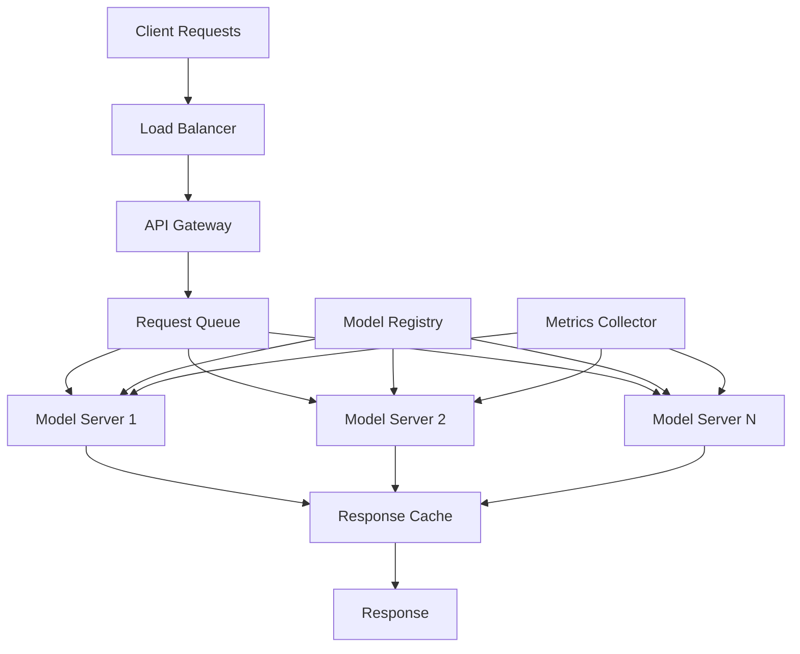

# Inference at Scale

Master the art of deploying transformer models for high-throughput, low-latency inference in production environments, from single-model serving to multi-model orchestration.

## 🎯 Learning Objectives

By the end of this module, you will understand:
- Production serving architectures and frameworks
- Batching strategies for optimal throughput
- Model parallelism and sharding for large models
- Caching strategies and memory optimization
- Load balancing and auto-scaling
- Multi-model serving and orchestration
- Edge deployment considerations

## 📚 Table of Contents

1. [Production Serving Fundamentals](#1-production-serving-fundamentals)
2. [Serving Frameworks](#2-serving-frameworks)
3. [Batching Strategies](#3-batching-strategies)
4. [Model Parallelism for Inference](#4-model-parallelism-for-inference)
5. [Caching and Memory Optimization](#5-caching-and-memory-optimization)
6. [Load Balancing and Scaling](#6-load-balancing-and-scaling)
7. [Multi-Model Serving](#7-multi-model-serving)
8. [Edge Deployment](#8-edge-deployment)

## 1. Production Serving Fundamentals

### 1.1 Key Metrics

When serving models at scale, optimize for:

| Metric | Definition | Target | Measurement |
|--------|-----------|--------|-------------|
| **Latency** | Time to process single request | <100ms | P50, P95, P99 |
| **Throughput** | Requests processed per second | >1000 RPS | Requests/second |
| **Availability** | Uptime percentage | >99.9% | Success rate |
| **Cost** | $ per million requests | Minimize | $/1M requests |
| **Resource Utilization** | GPU/CPU usage | 70-90% | % utilization |

### 1.2 Serving Architecture



### 1.3 Deployment Patterns

**1. Single Model Serving**
```python
# Basic serving pattern
class ModelServer:
    def __init__(self, model_path):
        self.model = load_model(model_path)
        self.device = torch.device("cuda" if torch.cuda.is_available() else "cpu")
        self.model.to(self.device)
        self.model.eval()
    
    def predict(self, inputs):
        with torch.no_grad():
            return self.model(inputs)
```

**2. Model Replication**
```python
# Multiple model instances for scaling
class ReplicatedModelServer:
    def __init__(self, model_path, num_replicas=4):
        self.models = []
        for i in range(num_replicas):
            device = torch.device(f"cuda:{i}")
            model = load_model(model_path).to(device)
            self.models.append(model)
    
    def predict(self, inputs, replica_id):
        return self.models[replica_id](inputs)
```

## 2. Serving Frameworks

### 2.1 Framework Comparison

| Framework | Pros | Cons | Best For |
|-----------|------|------|----------|
| **TorchServe** | Native PyTorch support, easy setup | Limited features | PyTorch models |
| **Triton** | Multi-framework, high performance | Complex setup | Mixed workloads |
| **TensorFlow Serving** | Mature, versioning | TF-specific | TensorFlow models |
| **ONNX Runtime** | Cross-platform, optimized | Conversion needed | Edge deployment |
| **Ray Serve** | Scalable, Python-native | Overhead | Complex pipelines |

### 2.2 TorchServe Example

```python
# handler.py
import torch
import json
from ts.torch_handler.base_handler import BaseHandler

class TransformerHandler(BaseHandler):
    def __init__(self):
        super().__init__()
        self.max_length = 512
        
    def preprocess(self, data):
        """Preprocess request data."""
        inputs = data[0].get("data")
        if isinstance(inputs, str):
            inputs = json.loads(inputs)
        
        # Tokenize inputs
        encoded = self.tokenizer(
            inputs["text"],
            max_length=self.max_length,
            truncation=True,
            padding=True,
            return_tensors="pt"
        )
        return encoded
    
    def inference(self, data):
        """Run inference."""
        with torch.no_grad():
            outputs = self.model(**data)
        return outputs
    
    def postprocess(self, data):
        """Format response."""
        predictions = torch.softmax(data.logits, dim=-1)
        return [{
            "predictions": predictions.tolist(),
            "shape": list(predictions.shape)
        }]
```

### 2.3 Triton Inference Server

```python
# model.py for Triton
import triton_python_backend_utils as pb_utils
import numpy as np
import torch

class TritonPythonModel:
    def initialize(self, args):
        """Load model and config."""
        self.model = torch.jit.load(
            f"{args['model_repository']}/1/model.pt"
        )
        self.device = torch.device("cuda:0")
        self.model.to(self.device)
        
    def execute(self, requests):
        """Process batch of requests."""
        responses = []
        
        for request in requests:
            # Get inputs
            input_ids = pb_utils.get_input_tensor_by_name(
                request, "input_ids"
            ).as_numpy()
            
            # Convert to torch
            input_ids = torch.from_numpy(input_ids).to(self.device)
            
            # Inference
            with torch.no_grad():
                outputs = self.model(input_ids)
            
            # Create response
            output_tensor = pb_utils.Tensor(
                "output",
                outputs.cpu().numpy()
            )
            response = pb_utils.InferenceResponse(
                output_tensors=[output_tensor]
            )
            responses.append(response)
            
        return responses
```

## 3. Batching Strategies

### 3.1 Static Batching

```python
class StaticBatcher:
    """Fixed batch size processing."""
    
    def __init__(self, batch_size=32):
        self.batch_size = batch_size
        self.queue = []
        
    def add_request(self, request):
        self.queue.append(request)
        
        if len(self.queue) >= self.batch_size:
            return self.process_batch()
        return None
    
    def process_batch(self):
        batch = self.queue[:self.batch_size]
        self.queue = self.queue[self.batch_size:]
        
        # Pad to same length
        max_len = max(len(req['input_ids']) for req in batch)
        padded_batch = []
        
        for req in batch:
            padded = self._pad_sequence(req['input_ids'], max_len)
            padded_batch.append(padded)
            
        return torch.stack(padded_batch)
```

### 3.2 Dynamic Batching

```python
class DynamicBatcher:
    """Adaptive batch size based on timing."""
    
    def __init__(self, max_batch_size=32, max_wait_ms=50):
        self.max_batch_size = max_batch_size
        self.max_wait_ms = max_wait_ms
        self.queue = []
        self.queue_times = []
        
    def add_request(self, request):
        current_time = time.time() * 1000
        self.queue.append(request)
        self.queue_times.append(current_time)
        
        # Check if should process
        if self._should_process_batch(current_time):
            return self.process_batch()
        return None
    
    def _should_process_batch(self, current_time):
        if len(self.queue) >= self.max_batch_size:
            return True
            
        if self.queue_times:
            oldest_time = self.queue_times[0]
            if current_time - oldest_time >= self.max_wait_ms:
                return True
                
        return False
```

### 3.3 Continuous Batching (Iteration-level)

```python
class ContinuousBatcher:
    """Continuous batching for generation."""
    
    def __init__(self, max_batch_size=32):
        self.max_batch_size = max_batch_size
        self.active_sequences = {}
        self.kv_cache = {}
        
    def add_sequence(self, seq_id, prompt):
        """Add new sequence to batch."""
        self.active_sequences[seq_id] = {
            'input_ids': prompt,
            'generated': [],
            'done': False
        }
        
    def generation_step(self):
        """Single generation step for all sequences."""
        # Collect active sequences
        batch_ids = []
        batch_inputs = []
        
        for seq_id, seq_data in self.active_sequences.items():
            if not seq_data['done']:
                batch_ids.append(seq_id)
                batch_inputs.append(seq_data['input_ids'][-1:])
                
        if not batch_inputs:
            return {}
            
        # Batch inference
        inputs = torch.cat(batch_inputs)
        outputs = self.model(inputs, past_key_values=self.kv_cache)
        
        # Update sequences
        results = {}
        for i, seq_id in enumerate(batch_ids):
            next_token = outputs.logits[i].argmax()
            self.active_sequences[seq_id]['input_ids'].append(next_token)
            self.active_sequences[seq_id]['generated'].append(next_token)
            
            # Check stopping condition
            if next_token == self.eos_token_id:
                self.active_sequences[seq_id]['done'] = True
                results[seq_id] = self.active_sequences[seq_id]['generated']
                
        return results
```

## 4. Model Parallelism for Inference

### 4.1 Pipeline Parallelism

```python
class PipelineParallelInference:
    """Split model across multiple GPUs."""
    
    def __init__(self, model, num_gpus=4):
        self.num_gpus = num_gpus
        self.stages = self._split_model(model)
        
    def _split_model(self, model):
        """Split model into pipeline stages."""
        layers = list(model.children())
        layers_per_gpu = len(layers) // self.num_gpus
        
        stages = []
        for i in range(self.num_gpus):
            start_idx = i * layers_per_gpu
            end_idx = start_idx + layers_per_gpu
            if i == self.num_gpus - 1:
                end_idx = len(layers)
                
            stage = nn.Sequential(*layers[start_idx:end_idx])
            stage.to(f'cuda:{i}')
            stages.append(stage)
            
        return stages
    
    def forward(self, x):
        """Pipeline forward pass."""
        for i, stage in enumerate(self.stages):
            x = x.to(f'cuda:{i}')
            x = stage(x)
        return x
```

### 4.2 Tensor Parallelism

```python
class TensorParallelLinear(nn.Module):
    """Split linear layer across devices."""
    
    def __init__(self, in_features, out_features, num_gpus=2):
        super().__init__()
        self.num_gpus = num_gpus
        self.split_size = out_features // num_gpus
        
        # Create splits
        self.weight_splits = nn.ParameterList([
            nn.Parameter(torch.randn(self.split_size, in_features))
            for _ in range(num_gpus)
        ])
        
        # Move to different GPUs
        for i, weight in enumerate(self.weight_splits):
            weight.data = weight.data.to(f'cuda:{i}')
            
    def forward(self, x):
        outputs = []
        
        for i, weight in enumerate(self.weight_splits):
            x_gpu = x.to(f'cuda:{i}')
            output = F.linear(x_gpu, weight)
            outputs.append(output)
            
        # Gather results
        gathered = torch.cat([o.to('cuda:0') for o in outputs], dim=-1)
        return gathered
```

## 5. Caching and Memory Optimization

### 5.1 KV Cache Management

```python
class KVCacheManager:
    """Efficient KV cache for generation."""
    
    def __init__(self, max_batch_size, max_seq_len, num_layers, 
                 num_heads, head_dim):
        self.max_batch_size = max_batch_size
        self.max_seq_len = max_seq_len
        
        # Pre-allocate cache
        cache_shape = (
            max_batch_size, num_heads, max_seq_len, head_dim
        )
        
        self.k_cache = [
            torch.zeros(cache_shape, dtype=torch.float16)
            for _ in range(num_layers)
        ]
        self.v_cache = [
            torch.zeros(cache_shape, dtype=torch.float16)
            for _ in range(num_layers)
        ]
        
        # Track usage
        self.cache_positions = torch.zeros(max_batch_size, dtype=torch.long)
        self.active_sequences = set()
        
    def allocate_sequence(self, batch_idx):
        """Allocate cache slot for new sequence."""
        self.active_sequences.add(batch_idx)
        self.cache_positions[batch_idx] = 0
        
    def update_cache(self, batch_idx, layer_idx, k, v):
        """Update cache for sequence."""
        seq_len = k.shape[2]
        pos = self.cache_positions[batch_idx]
        
        self.k_cache[layer_idx][batch_idx, :, pos:pos+seq_len] = k
        self.v_cache[layer_idx][batch_idx, :, pos:pos+seq_len] = v
        
        self.cache_positions[batch_idx] += seq_len
        
    def get_cache(self, batch_idx, layer_idx):
        """Retrieve cache for sequence."""
        pos = self.cache_positions[batch_idx]
        k = self.k_cache[layer_idx][batch_idx, :, :pos]
        v = self.v_cache[layer_idx][batch_idx, :, :pos]
        return k, v
    
    def free_sequence(self, batch_idx):
        """Free cache slot."""
        self.active_sequences.remove(batch_idx)
        self.cache_positions[batch_idx] = 0
```

### 5.2 Response Caching

```python
import hashlib
from functools import lru_cache
import redis

class ResponseCache:
    """Cache inference results."""
    
    def __init__(self, redis_host='localhost', ttl=3600):
        self.redis_client = redis.Redis(host=redis_host)
        self.ttl = ttl
        self.local_cache = {}
        
    def _get_cache_key(self, inputs):
        """Generate cache key from inputs."""
        input_str = json.dumps(inputs, sort_keys=True)
        return hashlib.md5(input_str.encode()).hexdigest()
    
    def get(self, inputs):
        """Get cached response."""
        key = self._get_cache_key(inputs)
        
        # Check local cache first
        if key in self.local_cache:
            return self.local_cache[key]
            
        # Check Redis
        cached = self.redis_client.get(key)
        if cached:
            result = json.loads(cached)
            self.local_cache[key] = result
            return result
            
        return None
    
    def set(self, inputs, outputs):
        """Cache response."""
        key = self._get_cache_key(inputs)
        
        # Store in both caches
        self.local_cache[key] = outputs
        self.redis_client.setex(
            key, 
            self.ttl, 
            json.dumps(outputs)
        )
```

### 5.3 Memory Pool Management

```python
class MemoryPool:
    """Pre-allocated memory pool for inference."""
    
    def __init__(self, pool_configs):
        self.pools = {}
        
        for name, config in pool_configs.items():
            shape = config['shape']
            dtype = config['dtype']
            count = config['count']
            
            # Pre-allocate tensors
            pool = []
            for _ in range(count):
                tensor = torch.empty(shape, dtype=dtype)
                pool.append(tensor)
                
            self.pools[name] = {
                'available': pool,
                'in_use': [],
                'shape': shape,
                'dtype': dtype
            }
            
    def allocate(self, pool_name):
        """Get tensor from pool."""
        pool = self.pools[pool_name]
        
        if pool['available']:
            tensor = pool['available'].pop()
            pool['in_use'].append(tensor)
            return tensor
        else:
            # Allocate new if pool exhausted
            tensor = torch.empty(
                pool['shape'], 
                dtype=pool['dtype']
            )
            pool['in_use'].append(tensor)
            return tensor
            
    def release(self, pool_name, tensor):
        """Return tensor to pool."""
        pool = self.pools[pool_name]
        pool['in_use'].remove(tensor)
        pool['available'].append(tensor)
```

## 6. Load Balancing and Scaling

### 6.1 Load Balancer Implementation

```python
class ModelLoadBalancer:
    """Distribute requests across model instances."""
    
    def __init__(self, model_servers):
        self.servers = model_servers
        self.server_loads = [0] * len(model_servers)
        self.server_latencies = [[] for _ in model_servers]
        
    def select_server(self, strategy='least_loaded'):
        """Select server based on strategy."""
        if strategy == 'round_robin':
            # Simple round-robin
            server_idx = self.request_count % len(self.servers)
            
        elif strategy == 'least_loaded':
            # Choose least loaded server
            server_idx = self.server_loads.index(min(self.server_loads))
            
        elif strategy == 'latency_aware':
            # Choose based on recent latencies
            avg_latencies = []
            for latencies in self.server_latencies:
                if latencies:
                    avg = sum(latencies[-10:]) / len(latencies[-10:])
                else:
                    avg = 0
                avg_latencies.append(avg)
                
            server_idx = avg_latencies.index(min(avg_latencies))
            
        else:
            server_idx = 0
            
        return server_idx
    
    async def route_request(self, request):
        """Route request to selected server."""
        server_idx = self.select_server()
        
        # Update load
        self.server_loads[server_idx] += 1
        
        try:
            # Send request
            start_time = time.time()
            response = await self.servers[server_idx].predict(request)
            latency = time.time() - start_time
            
            # Update metrics
            self.server_latencies[server_idx].append(latency)
            
            return response
            
        finally:
            # Update load
            self.server_loads[server_idx] -= 1
```

### 6.2 Auto-scaling

```python
class AutoScaler:
    """Automatically scale model instances."""
    
    def __init__(self, min_instances=1, max_instances=10):
        self.min_instances = min_instances
        self.max_instances = max_instances
        self.current_instances = min_instances
        self.metrics_history = []
        
    def update_metrics(self, metrics):
        """Update scaling metrics."""
        self.metrics_history.append({
            'timestamp': time.time(),
            'avg_latency': metrics['avg_latency'],
            'queue_size': metrics['queue_size'],
            'cpu_usage': metrics['cpu_usage'],
            'gpu_usage': metrics['gpu_usage']
        })
        
        # Keep last 5 minutes
        cutoff = time.time() - 300
        self.metrics_history = [
            m for m in self.metrics_history 
            if m['timestamp'] > cutoff
        ]
        
    def should_scale(self):
        """Determine if scaling needed."""
        if len(self.metrics_history) < 10:
            return 0
            
        # Calculate averages
        avg_latency = sum(m['avg_latency'] for m in self.metrics_history[-10:]) / 10
        avg_queue = sum(m['queue_size'] for m in self.metrics_history[-10:]) / 10
        avg_gpu = sum(m['gpu_usage'] for m in self.metrics_history[-10:]) / 10
        
        # Scale up conditions
        if avg_latency > 100 or avg_queue > 50 or avg_gpu > 90:
            if self.current_instances < self.max_instances:
                return 1  # Scale up
                
        # Scale down conditions
        if avg_latency < 20 and avg_queue < 5 and avg_gpu < 30:
            if self.current_instances > self.min_instances:
                return -1  # Scale down
                
        return 0  # No scaling
```

## 7. Multi-Model Serving

### 7.1 Model Router

```python
class ModelRouter:
    """Route requests to appropriate models."""
    
    def __init__(self):
        self.models = {}
        self.routing_rules = {}
        
    def register_model(self, name, model, routing_rule):
        """Register model with routing rule."""
        self.models[name] = model
        self.routing_rules[name] = routing_rule
        
    def route(self, request):
        """Route request to appropriate model."""
        # Extract routing features
        text_length = len(request.get('text', ''))
        language = request.get('language', 'en')
        task = request.get('task', 'default')
        
        # Apply routing rules
        for model_name, rule in self.routing_rules.items():
            if rule(request, text_length, language, task):
                return self.models[model_name]
                
        # Default model
        return self.models.get('default')
        
    def create_routing_rules(self):
        """Example routing rules."""
        rules = {
            'small_model': lambda req, length, lang, task: length < 128,
            'multilingual_model': lambda req, length, lang, task: lang != 'en',
            'specialized_model': lambda req, length, lang, task: task == 'medical',
            'large_model': lambda req, length, lang, task: length > 512
        }
        return rules
```

### 7.2 Model Ensemble

```python
class ModelEnsemble:
    """Ensemble multiple models for better accuracy."""
    
    def __init__(self, models, weights=None):
        self.models = models
        self.weights = weights or [1.0 / len(models)] * len(models)
        
    def predict(self, inputs):
        """Ensemble prediction."""
        all_outputs = []
        
        # Get predictions from all models
        for model in self.models:
            with torch.no_grad():
                outputs = model(inputs)
                all_outputs.append(outputs)
                
        # Weighted average
        if hasattr(all_outputs[0], 'logits'):
            # For classification
            ensemble_logits = sum(
                w * out.logits 
                for w, out in zip(self.weights, all_outputs)
            )
            return ensemble_logits
        else:
            # For generation
            # Use voting or other strategies
            return self._ensemble_generation(all_outputs)
            
    def _ensemble_generation(self, outputs):
        """Ensemble strategy for generation."""
        # Simple voting for each position
        batch_size, seq_len, vocab_size = outputs[0].shape
        ensemble_output = torch.zeros(batch_size, seq_len, vocab_size)
        
        for pos in range(seq_len):
            for out, weight in zip(outputs, self.weights):
                ensemble_output[:, pos] += weight * out[:, pos]
                
        return ensemble_output
```

## 8. Edge Deployment

### 8.1 Model Optimization for Edge

```python
class EdgeOptimizer:
    """Optimize models for edge deployment."""
    
    def __init__(self):
        self.optimizations = []
        
    def quantize_model(self, model, backend='qnnpack'):
        """Quantize model for mobile."""
        model.eval()
        
        # Set quantization backend
        torch.backends.quantized.engine = backend
        
        # Prepare for quantization
        model.qconfig = torch.quantization.get_default_qconfig(backend)
        model_prepared = torch.quantization.prepare(model)
        
        # Calibrate with representative data
        self._calibrate_model(model_prepared)
        
        # Convert to quantized
        model_quantized = torch.quantization.convert(model_prepared)
        
        return model_quantized
    
    def optimize_for_mobile(self, model):
        """Apply mobile-specific optimizations."""
        model.eval()
        
        # Optimize for mobile
        from torch.utils.mobile_optimizer import optimize_for_mobile
        
        # Trace model
        example_input = torch.rand(1, 512)
        traced_model = torch.jit.trace(model, example_input)
        
        # Optimize
        optimized = optimize_for_mobile(traced_model)
        
        return optimized
    
    def split_model_for_edge(self, model, max_size_mb=50):
        """Split model into smaller chunks."""
        # Calculate model size
        param_size = sum(p.numel() * p.element_size() for p in model.parameters())
        model_size_mb = param_size / (1024 * 1024)
        
        if model_size_mb <= max_size_mb:
            return [model]
            
        # Split into chunks
        num_chunks = int(np.ceil(model_size_mb / max_size_mb))
        chunks = self._split_model(model, num_chunks)
        
        return chunks
```

### 8.2 Edge Serving Server

```python
class EdgeServer:
    """Lightweight server for edge devices."""
    
    def __init__(self, model_path, max_batch_size=1):
        self.model = self._load_optimized_model(model_path)
        self.max_batch_size = max_batch_size
        self.request_queue = []
        
    def _load_optimized_model(self, path):
        """Load mobile-optimized model."""
        if path.endswith('.ptl'):
            # Load mobile model
            model = torch.jit.load(path)
        else:
            # Load regular model
            model = torch.load(path)
            
        model.eval()
        return model
    
    async def serve(self, request):
        """Process request with minimal overhead."""
        # Add to queue
        self.request_queue.append(request)
        
        # Process if batch ready or timeout
        if len(self.request_queue) >= self.max_batch_size:
            return await self._process_batch()
            
        # Wait for more requests (with timeout)
        await asyncio.sleep(0.01)  # 10ms timeout
        return await self._process_batch()
        
    async def _process_batch(self):
        """Process queued requests."""
        if not self.request_queue:
            return None
            
        # Take available requests
        batch = self.request_queue[:self.max_batch_size]
        self.request_queue = self.request_queue[self.max_batch_size:]
        
        # Prepare inputs
        inputs = self._prepare_batch(batch)
        
        # Run inference
        with torch.no_grad():
            outputs = self.model(inputs)
            
        # Return results
        return self._format_outputs(outputs, batch)
```

## 📊 Performance Optimization Checklist

### Pre-deployment
- [ ] Profile model performance
- [ ] Identify bottlenecks
- [ ] Choose appropriate framework
- [ ] Optimize model (quantization, pruning)
- [ ] Implement batching strategy

### Deployment
- [ ] Set up monitoring
- [ ] Configure auto-scaling
- [ ] Implement caching
- [ ] Set up load balancing
- [ ] Configure health checks

### Post-deployment
- [ ] Monitor latency metrics
- [ ] Track resource utilization
- [ ] Analyze error rates
- [ ] Optimize based on real traffic
- [ ] A/B test optimizations

## 🔍 Best Practices

1. **Start Simple**: Begin with single model serving, then scale
2. **Monitor Everything**: Latency, throughput, errors, resource usage
3. **Cache Aggressively**: Cache at multiple levels
4. **Batch Wisely**: Balance latency vs throughput
5. **Plan for Failures**: Implement circuit breakers and fallbacks
6. **Version Models**: Support rolling updates and rollbacks
7. **Optimize Iteratively**: Profile → Optimize → Measure → Repeat

## 📈 Scaling Guidelines

| Scale | Users | RPS | Architecture |
|-------|-------|-----|--------------|
| Small | <1K | <10 | Single instance |
| Medium | 1K-100K | 10-1K | Replicated instances |
| Large | 100K-1M | 1K-10K | Distributed + caching |
| XLarge | >1M | >10K | Multi-region + CDN |

## 📝 Summary

Inference at scale requires:
- **Architecture**: Proper serving infrastructure
- **Optimization**: Batching, caching, parallelism
- **Monitoring**: Comprehensive metrics and alerting
- **Scaling**: Auto-scaling based on demand
- **Reliability**: Redundancy and fallbacks

The key is to start simple and scale based on actual needs, always measuring impact.

## ➡️ Next Steps

Ready to evaluate your models properly? Head to [Topic 14: Evaluation and Safety](../14-evaluation-safety/) to learn about comprehensive model evaluation and safety measures!