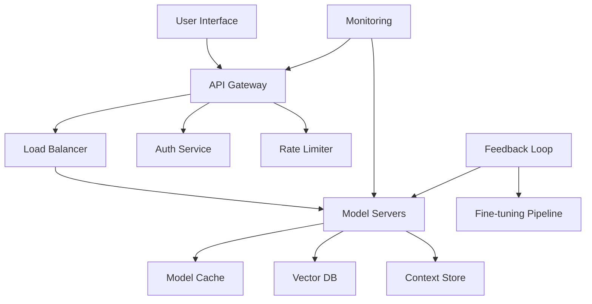

# Real-world Applications

Explore practical implementations of transformer models across various domains, from chatbots and translation systems to code generation and multimodal applications.

## 🎯 Learning Objectives

By the end of this module, you will understand:
- How to build production-ready applications with transformers
- Best practices for different application domains
- Integration with existing systems
- Deployment strategies and considerations
- Performance optimization for real-world use cases
- Ethical considerations and responsible deployment

## 📚 Table of Contents

1. [Application Domains Overview](#1-application-domains-overview)
2. [Conversational AI and Chatbots](#2-conversational-ai-and-chatbots)
3. [Machine Translation Systems](#3-machine-translation-systems)
4. [Code Generation and Development Tools](#4-code-generation-and-development-tools)
5. [Content Creation and Summarization](#5-content-creation-and-summarization)
6. [Question Answering Systems](#6-question-answering-systems)
7. [Multimodal Applications](#7-multimodal-applications)
8. [Enterprise Integration](#8-enterprise-integration)

## 1. Application Domains Overview

### 1.1 Transformer Applications Landscape

Transformers have revolutionized numerous domains:

| Domain | Applications | Key Models | Business Impact |
|--------|--------------|------------|-----------------|
| **Conversational AI** | Chatbots, Virtual Assistants | GPT-4, Claude, LLaMA | Customer service automation |
| **Translation** | Document translation, Real-time translation | mBART, M2M-100 | Global communication |
| **Code Generation** | Code completion, Bug fixing | Codex, CodeLLaMA | Developer productivity |
| **Content Creation** | Writing assistance, Marketing copy | GPT-3/4, Claude | Content scaling |
| **Search & QA** | Information retrieval, Support systems | BERT, T5 | Knowledge management |
| **Healthcare** | Clinical notes, Drug discovery | BioBERT, ClinicalBERT | Medical efficiency |
| **Finance** | Report analysis, Risk assessment | FinBERT, BloombergGPT | Financial insights |
| **Education** | Tutoring, Content generation | GPT-4, Custom models | Personalized learning |

### 1.2 Architecture Patterns



### 1.3 Common Implementation Patterns

```python
class TransformerApplication:
    """Base class for transformer applications."""
    
    def __init__(self, model_name: str, config: dict):
        self.model = self.load_model(model_name)
        self.config = config
        self.cache = self.initialize_cache()
        self.monitor = self.setup_monitoring()
        
    def process_request(self, input_data: dict) -> dict:
        """Standard request processing pipeline."""
        # 1. Validate input
        validated = self.validate_input(input_data)
        
        # 2. Check cache
        cache_key = self.generate_cache_key(validated)
        if cached := self.cache.get(cache_key):
            return cached
            
        # 3. Preprocess
        processed = self.preprocess(validated)
        
        # 4. Model inference
        output = self.model_inference(processed)
        
        # 5. Postprocess
        result = self.postprocess(output)
        
        # 6. Cache result
        self.cache.set(cache_key, result)
        
        # 7. Log metrics
        self.monitor.log_request(input_data, result)
        
        return result
```

## 2. Conversational AI and Chatbots

### 2.1 Architecture Components

```python
class ConversationalAgent:
    """Production-ready conversational AI system."""
    
    def __init__(self, model, config):
        self.model = model
        self.config = config
        self.conversation_manager = ConversationManager()
        self.context_window = config.get('context_window', 4096)
        self.safety_filter = SafetyFilter()
        
    def chat(self, user_message: str, conversation_id: str) -> str:
        """Handle chat interaction."""
        # Retrieve conversation history
        history = self.conversation_manager.get_history(conversation_id)
        
        # Build context
        context = self.build_context(history, user_message)
        
        # Safety check
        if not self.safety_filter.is_safe(user_message):
            return self.generate_safe_response()
            
        # Generate response
        response = self.generate_response(context)
        
        # Post-process
        response = self.post_process_response(response)
        
        # Update history
        self.conversation_manager.update_history(
            conversation_id, user_message, response
        )
        
        return response
    
    def build_context(self, history: List[dict], 
                     current_message: str) -> str:
        """Build context with proper formatting."""
        # Format conversation history
        formatted_history = []
        
        for turn in history[-10:]:  # Last 10 turns
            formatted_history.append(
                f"User: {turn['user']}\nAssistant: {turn['assistant']}"
            )
            
        # Construct prompt
        context = "\n\n".join(formatted_history)
        context += f"\n\nUser: {current_message}\nAssistant:"
        
        # Truncate if needed
        if self.count_tokens(context) > self.context_window - 500:
            context = self.truncate_context(context)
            
        return context
```

### 2.2 Conversation Management

```python
class ConversationManager:
    """Manage conversation state and history."""
    
    def __init__(self, storage_backend='redis'):
        self.storage = self.initialize_storage(storage_backend)
        self.max_history_length = 100
        
    def get_history(self, conversation_id: str) -> List[dict]:
        """Retrieve conversation history."""
        history = self.storage.get(f"conv:{conversation_id}")
        return json.loads(history) if history else []
        
    def update_history(self, conversation_id: str, 
                      user_message: str, 
                      assistant_response: str):
        """Update conversation history."""
        history = self.get_history(conversation_id)
        
        # Add new turn
        history.append({
            'user': user_message,
            'assistant': assistant_response,
            'timestamp': time.time()
        })
        
        # Trim if too long
        if len(history) > self.max_history_length:
            history = history[-self.max_history_length:]
            
        # Save
        self.storage.set(
            f"conv:{conversation_id}", 
            json.dumps(history),
            expire=86400  # 24 hours
        )
```

### 2.3 Advanced Features

```python
class AdvancedChatbot(ConversationalAgent):
    """Chatbot with advanced capabilities."""
    
    def __init__(self, model, config):
        super().__init__(model, config)
        self.persona = config.get('persona', 'helpful assistant')
        self.tools = self.initialize_tools()
        self.memory = LongTermMemory()
        
    def generate_response(self, context: str) -> str:
        """Generate response with tool use."""
        # Check if tool use is needed
        if tool_needed := self.detect_tool_need(context):
            return self.use_tool(tool_needed, context)
            
        # Check for relevant memories
        memories = self.memory.search(context)
        if memories:
            context = self.augment_with_memories(context, memories)
            
        # Generate with persona
        prompt = f"You are a {self.persona}. {context}"
        
        response = self.model.generate(
            prompt,
            temperature=0.7,
            max_tokens=500,
            stop_sequences=["\nUser:", "\nHuman:"]
        )
        
        return response
    
    def use_tool(self, tool_name: str, context: str) -> str:
        """Execute tool and return result."""
        tool = self.tools.get(tool_name)
        if not tool:
            return "I don't have access to that tool."
            
        # Extract parameters from context
        params = self.extract_tool_params(context, tool)
        
        # Execute tool
        try:
            result = tool.execute(**params)
            return self.format_tool_response(result)
        except Exception as e:
            return f"Error using {tool_name}: {str(e)}"
```

## 3. Machine Translation Systems

### 3.1 Translation Pipeline

```python
class TranslationSystem:
    """Production translation system."""
    
    def __init__(self, model_registry: dict):
        self.models = model_registry  # {lang_pair: model}
        self.tokenizers = self.load_tokenizers()
        self.language_detector = LanguageDetector()
        self.quality_estimator = QualityEstimator()
        
    def translate(self, text: str, 
                 source_lang: str = None,
                 target_lang: str = 'en') -> dict:
        """Translate text with quality estimation."""
        # Detect source language if not provided
        if not source_lang:
            source_lang = self.language_detector.detect(text)
            
        # Select model
        model_key = f"{source_lang}-{target_lang}"
        if model_key not in self.models:
            return {"error": f"Translation pair {model_key} not supported"}
            
        model = self.models[model_key]
        tokenizer = self.tokenizers[model_key]
        
        # Preprocess
        prepared_text = self.preprocess_text(text, source_lang)
        
        # Tokenize
        inputs = tokenizer(prepared_text, return_tensors="pt", 
                          max_length=512, truncation=True)
        
        # Translate
        with torch.no_grad():
            outputs = model.generate(
                **inputs,
                max_length=512,
                num_beams=5,
                temperature=0.7,
                do_sample=False
            )
            
        # Decode
        translation = tokenizer.decode(outputs[0], skip_special_tokens=True)
        
        # Post-process
        translation = self.postprocess_text(translation, target_lang)
        
        # Estimate quality
        quality_score = self.quality_estimator.estimate(
            text, translation, source_lang, target_lang
        )
        
        return {
            "translation": translation,
            "source_language": source_lang,
            "target_language": target_lang,
            "quality_score": quality_score,
            "confidence": self._calculate_confidence(outputs)
        }
```

### 3.2 Document Translation

```python
class DocumentTranslator:
    """Translate entire documents while preserving formatting."""
    
    def __init__(self, translation_system: TranslationSystem):
        self.translator = translation_system
        self.formatters = {
            'pdf': PDFFormatter(),
            'docx': DocxFormatter(),
            'html': HTMLFormatter(),
            'markdown': MarkdownFormatter()
        }
        
    def translate_document(self, file_path: str, 
                         target_lang: str,
                         preserve_formatting: bool = True) -> str:
        """Translate document maintaining structure."""
        # Detect format
        file_format = self.detect_format(file_path)
        formatter = self.formatters.get(file_format)
        
        if not formatter:
            raise ValueError(f"Unsupported format: {file_format}")
            
        # Extract content
        content_blocks = formatter.extract_content(file_path)
        
        # Translate each block
        translated_blocks = []
        
        for block in content_blocks:
            if block['type'] == 'text':
                # Translate text
                result = self.translator.translate(
                    block['content'],
                    target_lang=target_lang
                )
                translated_blocks.append({
                    **block,
                    'content': result['translation']
                })
            else:
                # Keep non-text blocks as is
                translated_blocks.append(block)
                
        # Reconstruct document
        output_path = self.generate_output_path(file_path, target_lang)
        formatter.reconstruct_document(translated_blocks, output_path)
        
        return output_path
```

## 4. Code Generation and Development Tools

### 4.1 Code Assistant Implementation

```python
class CodeAssistant:
    """AI-powered coding assistant."""
    
    def __init__(self, model, language_parsers: dict):
        self.model = model
        self.parsers = language_parsers
        self.code_analyzer = CodeAnalyzer()
        self.test_runner = TestRunner()
        
    def complete_code(self, partial_code: str, 
                     language: str,
                     context: dict = None) -> dict:
        """Complete code with context awareness."""
        # Parse existing code
        ast = self.parsers[language].parse(partial_code)
        
        # Extract context
        code_context = self.extract_context(ast, context)
        
        # Build prompt
        prompt = self.build_completion_prompt(
            partial_code, code_context, language
        )
        
        # Generate completion
        completion = self.model.generate(
            prompt,
            max_tokens=150,
            temperature=0.2,
            stop_sequences=["\n\n", "def ", "class "]
        )
        
        # Validate syntax
        full_code = partial_code + completion
        is_valid, errors = self.validate_syntax(full_code, language)
        
        # Run safety checks
        safety_issues = self.code_analyzer.check_safety(completion)
        
        return {
            "completion": completion,
            "full_code": full_code,
            "is_valid": is_valid,
            "syntax_errors": errors,
            "safety_issues": safety_issues,
            "confidence": self.calculate_confidence(completion)
        }
    
    def generate_tests(self, code: str, language: str) -> str:
        """Generate unit tests for code."""
        # Analyze code structure
        functions = self.extract_functions(code, language)
        
        tests = []
        for func in functions:
            # Generate test cases
            prompt = f"""Generate comprehensive unit tests for this {language} function:

{func['code']}

Include edge cases and error handling tests."""
            
            test_code = self.model.generate(prompt, max_tokens=300)
            tests.append(test_code)
            
        return "\n\n".join(tests)
    
    def explain_code(self, code: str, language: str) -> str:
        """Generate detailed code explanation."""
        prompt = f"""Explain this {language} code in detail:

{code}

Include:
1. What the code does
2. How it works step-by-step  
3. Time and space complexity
4. Potential improvements"""

        explanation = self.model.generate(
            prompt,
            max_tokens=500,
            temperature=0.3
        )
        
        return explanation
```

### 4.2 Code Review Assistant

```python
class CodeReviewAssistant:
    """Automated code review system."""
    
    def __init__(self, model, style_guides: dict):
        self.model = model
        self.style_guides = style_guides
        self.security_scanner = SecurityScanner()
        self.performance_analyzer = PerformanceAnalyzer()
        
    def review_pull_request(self, pr_data: dict) -> dict:
        """Comprehensive PR review."""
        reviews = {
            'summary': '',
            'issues': [],
            'suggestions': [],
            'security': [],
            'performance': []
        }
        
        # Analyze each changed file
        for file in pr_data['changed_files']:
            file_review = self.review_file(
                file['content'],
                file['language'],
                file['diff']
            )
            
            reviews['issues'].extend(file_review['issues'])
            reviews['suggestions'].extend(file_review['suggestions'])
            
        # Security scan
        security_issues = self.security_scanner.scan(pr_data)
        reviews['security'] = security_issues
        
        # Performance analysis
        perf_issues = self.performance_analyzer.analyze(pr_data)
        reviews['performance'] = perf_issues
        
        # Generate summary
        reviews['summary'] = self.generate_review_summary(reviews)
        
        return reviews
    
    def review_file(self, content: str, language: str, 
                   diff: str) -> dict:
        """Review individual file."""
        prompt = f"""Review this {language} code change:

{diff}

Full file context:
{content}

Identify:
1. Bugs or potential issues
2. Style guide violations
3. Performance concerns
4. Suggestions for improvement"""

        review = self.model.generate(prompt, max_tokens=400)
        
        # Parse structured feedback
        issues = self.extract_issues(review)
        suggestions = self.extract_suggestions(review)
        
        return {
            'issues': issues,
            'suggestions': suggestions,
            'raw_review': review
        }
```

## 5. Content Creation and Summarization

### 5.1 Content Generation System

```python
class ContentGenerator:
    """Multi-purpose content generation system."""
    
    def __init__(self, model, templates: dict):
        self.model = model
        self.templates = templates
        self.seo_optimizer = SEOOptimizer()
        self.plagiarism_checker = PlagiarismChecker()
        
    def generate_article(self, topic: str, 
                       style: str = 'informative',
                       word_count: int = 500,
                       keywords: List[str] = None) -> dict:
        """Generate complete article."""
        # Research phase
        research = self.research_topic(topic)
        
        # Create outline
        outline = self.generate_outline(topic, research, style)
        
        # Generate content for each section
        sections = []
        current_word_count = 0
        
        for section in outline:
            section_content = self.generate_section(
                section, 
                research,
                style,
                remaining_words=word_count - current_word_count
            )
            sections.append(section_content)
            current_word_count += len(section_content.split())
            
        # Combine sections
        article = "\n\n".join(sections)
        
        # SEO optimization
        if keywords:
            article = self.seo_optimizer.optimize(article, keywords)
            
        # Plagiarism check
        plagiarism_score = self.plagiarism_checker.check(article)
        
        return {
            "content": article,
            "word_count": len(article.split()),
            "outline": outline,
            "seo_score": self.seo_optimizer.score(article, keywords),
            "plagiarism_score": plagiarism_score,
            "readability_score": self.calculate_readability(article)
        }
    
    def generate_marketing_copy(self, product: dict, 
                              platform: str,
                              tone: str = 'professional') -> str:
        """Generate marketing copy for different platforms."""
        templates = {
            'email': self.templates['email_marketing'],
            'social': self.templates['social_media'],
            'landing': self.templates['landing_page'],
            'ad': self.templates['ad_copy']
        }
        
        template = templates.get(platform, self.templates['generic'])
        
        prompt = template.format(
            product_name=product['name'],
            features=', '.join(product['features']),
            benefits=', '.join(product['benefits']),
            tone=tone
        )
        
        copy = self.model.generate(
            prompt,
            max_tokens=300,
            temperature=0.8
        )
        
        # Platform-specific formatting
        copy = self.format_for_platform(copy, platform)
        
        return copy
```

### 5.2 Intelligent Summarization

```python
class Summarizer:
    """Advanced summarization system."""
    
    def __init__(self, model):
        self.model = model
        self.chunk_size = 1024
        self.overlap = 128
        
    def summarize(self, text: str, 
                 style: str = 'concise',
                 max_length: int = 150) -> dict:
        """Generate summary with different styles."""
        # Handle long documents
        if self.is_long_document(text):
            return self.hierarchical_summarize(text, style, max_length)
            
        # Standard summarization
        prompt = self.get_summary_prompt(text, style)
        
        summary = self.model.generate(
            prompt,
            max_tokens=max_length,
            temperature=0.3
        )
        
        # Extract key points
        key_points = self.extract_key_points(text)
        
        # Generate metadata
        metadata = self.generate_metadata(text, summary)
        
        return {
            "summary": summary,
            "key_points": key_points,
            "style": style,
            "compression_ratio": len(text) / len(summary),
            "metadata": metadata
        }
    
    def hierarchical_summarize(self, text: str, 
                             style: str,
                             max_length: int) -> dict:
        """Summarize long documents hierarchically."""
        # Split into chunks
        chunks = self.split_into_chunks(text)
        
        # Summarize each chunk
        chunk_summaries = []
        for chunk in chunks:
            chunk_summary = self.summarize(
                chunk, 
                style='detailed',
                max_length=200
            )
            chunk_summaries.append(chunk_summary['summary'])
            
        # Combine chunk summaries
        combined = "\n\n".join(chunk_summaries)
        
        # Final summary
        final_summary = self.summarize(
            combined,
            style=style,
            max_length=max_length
        )
        
        return {
            **final_summary,
            "method": "hierarchical",
            "num_chunks": len(chunks)
        }
```

## 6. Question Answering Systems

### 6.1 Knowledge Base QA

```python
class QuestionAnsweringSystem:
    """RAG-based QA system."""
    
    def __init__(self, model, vector_store, knowledge_base):
        self.model = model
        self.vector_store = vector_store
        self.knowledge_base = knowledge_base
        self.reranker = Reranker()
        
    def answer_question(self, question: str, 
                       context: dict = None) -> dict:
        """Answer question using retrieval-augmented generation."""
        # Retrieve relevant documents
        retrieved_docs = self.vector_store.search(
            question,
            k=10,
            filters=context
        )
        
        # Rerank documents
        reranked_docs = self.reranker.rerank(
            question,
            retrieved_docs,
            top_k=3
        )
        
        # Build context
        context = self.build_qa_context(question, reranked_docs)
        
        # Generate answer
        answer = self.model.generate(
            context,
            max_tokens=200,
            temperature=0.3
        )
        
        # Extract citations
        citations = self.extract_citations(answer, reranked_docs)
        
        # Verify factuality
        factuality_score = self.verify_answer(answer, reranked_docs)
        
        return {
            "answer": answer,
            "sources": reranked_docs,
            "citations": citations,
            "confidence": factuality_score,
            "metadata": {
                "retrieval_count": len(retrieved_docs),
                "sources_used": len(citations)
            }
        }
    
    def build_qa_context(self, question: str, 
                        documents: List[dict]) -> str:
        """Build context for QA."""
        context_parts = [
            "Answer the following question based on the provided context.",
            f"Question: {question}",
            "\nContext:"
        ]
        
        for i, doc in enumerate(documents):
            context_parts.append(f"\n[{i+1}] {doc['content']}")
            
        context_parts.append("\nAnswer:")
        
        return "\n".join(context_parts)
```

### 6.2 Multi-hop Reasoning

```python
class MultiHopQA(QuestionAnsweringSystem):
    """QA system with multi-hop reasoning capabilities."""
    
    def answer_complex_question(self, question: str) -> dict:
        """Answer questions requiring multiple reasoning steps."""
        # Decompose question
        sub_questions = self.decompose_question(question)
        
        # Answer each sub-question
        sub_answers = []
        evidence = []
        
        for sub_q in sub_questions:
            result = self.answer_question(sub_q)
            sub_answers.append({
                "question": sub_q,
                "answer": result['answer'],
                "sources": result['sources']
            })
            evidence.extend(result['sources'])
            
        # Synthesize final answer
        final_answer = self.synthesize_answer(
            question,
            sub_answers,
            evidence
        )
        
        # Build reasoning chain
        reasoning_chain = self.build_reasoning_chain(
            sub_questions,
            sub_answers
        )
        
        return {
            "answer": final_answer,
            "reasoning_steps": sub_questions,
            "intermediate_answers": sub_answers,
            "reasoning_chain": reasoning_chain,
            "evidence": evidence
        }
    
    def decompose_question(self, question: str) -> List[str]:
        """Break complex question into sub-questions."""
        prompt = f"""Decompose this complex question into simpler sub-questions:

Question: {question}

List each sub-question that needs to be answered to fully address the main question."""

        response = self.model.generate(prompt, max_tokens=200)
        
        # Parse sub-questions
        sub_questions = self.parse_sub_questions(response)
        
        return sub_questions
```

## 7. Multimodal Applications

### 7.1 Vision-Language Applications

```python
class VisionLanguageModel:
    """Multimodal vision-language applications."""
    
    def __init__(self, model, image_encoder):
        self.model = model
        self.image_encoder = image_encoder
        self.caption_generator = CaptionGenerator()
        self.vqa_model = VisualQAModel()
        
    def analyze_image(self, image_path: str, 
                     task: str = 'describe') -> dict:
        """Comprehensive image analysis."""
        # Load and preprocess image
        image = self.load_image(image_path)
        
        # Encode image
        image_features = self.image_encoder.encode(image)
        
        results = {}
        
        if task in ['describe', 'all']:
            # Generate description
            description = self.generate_description(image_features)
            results['description'] = description
            
        if task in ['caption', 'all']:
            # Generate caption
            caption = self.caption_generator.generate(image_features)
            results['caption'] = caption
            
        if task in ['objects', 'all']:
            # Detect objects
            objects = self.detect_objects(image_features)
            results['objects'] = objects
            
        if task in ['ocr', 'all']:
            # Extract text
            text = self.extract_text(image)
            results['text'] = text
            
        return results
    
    def visual_question_answering(self, image_path: str, 
                                 question: str) -> str:
        """Answer questions about images."""
        image = self.load_image(image_path)
        image_features = self.image_encoder.encode(image)
        
        # Combine image and text features
        combined_features = self.combine_modalities(
            image_features,
            question
        )
        
        # Generate answer
        answer = self.vqa_model.answer(combined_features)
        
        return answer
```

### 7.2 Audio-Language Applications

```python
class AudioLanguageModel:
    """Audio-language multimodal applications."""
    
    def __init__(self, model, audio_encoder):
        self.model = model
        self.audio_encoder = audio_encoder
        self.transcriber = Transcriber()
        
    def analyze_audio(self, audio_path: str) -> dict:
        """Comprehensive audio analysis."""
        # Load audio
        audio_data = self.load_audio(audio_path)
        
        # Transcribe speech
        transcription = self.transcriber.transcribe(audio_data)
        
        # Analyze audio features
        audio_features = self.audio_encoder.encode(audio_data)
        
        # Detect speaker emotions
        emotions = self.detect_emotions(audio_features)
        
        # Identify speakers
        speakers = self.identify_speakers(audio_features)
        
        # Generate summary
        if transcription['text']:
            summary = self.summarize_transcript(transcription['text'])
        else:
            summary = "No speech detected"
            
        return {
            "transcription": transcription,
            "emotions": emotions,
            "speakers": speakers,
            "summary": summary,
            "duration": self.get_duration(audio_data),
            "audio_quality": self.assess_quality(audio_data)
        }
```

## 8. Enterprise Integration

### 8.1 Enterprise Architecture

```python
class EnterpriseTransformerPlatform:
    """Enterprise-grade transformer platform."""
    
    def __init__(self, config: dict):
        self.config = config
        self.model_registry = ModelRegistry()
        self.api_gateway = APIGateway()
        self.auth_service = AuthenticationService()
        self.monitoring = MonitoringService()
        self.data_pipeline = DataPipeline()
        
    def deploy_model(self, model_config: dict) -> str:
        """Deploy model to production."""
        # Validate model
        validation_result = self.validate_model(model_config)
        if not validation_result['passed']:
            raise ValueError(f"Model validation failed: {validation_result['errors']}")
            
        # Register model
        model_id = self.model_registry.register(model_config)
        
        # Deploy to serving infrastructure
        deployment = self.deploy_to_servers(model_id, model_config)
        
        # Configure routing
        self.api_gateway.add_route(
            path=f"/models/{model_id}",
            handler=deployment['endpoint']
        )
        
        # Set up monitoring
        self.monitoring.configure_model_monitoring(model_id)
        
        return model_id
    
    def create_api_endpoint(self, model_id: str, 
                          endpoint_config: dict) -> dict:
        """Create API endpoint for model."""
        # Configure endpoint
        endpoint = self.api_gateway.create_endpoint({
            'model_id': model_id,
            'path': endpoint_config['path'],
            'methods': endpoint_config.get('methods', ['POST']),
            'auth_required': endpoint_config.get('auth_required', True),
            'rate_limit': endpoint_config.get('rate_limit', 100),
            'cache_ttl': endpoint_config.get('cache_ttl', 300)
        })
        
        # Set up request processing
        endpoint.add_middleware([
            self.auth_service.authenticate,
            self.validate_request,
            self.rate_limiter.check,
            self.cache.check
        ])
        
        # Configure response processing
        endpoint.add_response_processors([
            self.format_response,
            self.add_metadata,
            self.log_request
        ])
        
        return {
            'endpoint_id': endpoint.id,
            'url': endpoint.url,
            'api_key_required': endpoint_config.get('auth_required', True)
        }
```

### 8.2 Integration Patterns

```python
class TransformerIntegration:
    """Common integration patterns."""
    
    @staticmethod
    def webhook_integration(webhook_url: str, model_fn: Callable):
        """Integrate via webhooks."""
        async def process_webhook(request):
            # Parse webhook data
            data = await request.json()
            
            # Process with model
            result = model_fn(data)
            
            # Send response
            async with aiohttp.ClientSession() as session:
                await session.post(webhook_url, json=result)
                
        return process_webhook
    
    @staticmethod
    def streaming_integration(model_fn: Callable):
        """Real-time streaming integration."""
        async def stream_handler(websocket, path):
            async for message in websocket:
                # Process message
                data = json.loads(message)
                
                # Generate response
                response = model_fn(data)
                
                # Stream back
                await websocket.send(json.dumps(response))
                
        return stream_handler
    
    @staticmethod
    def batch_integration(model_fn: Callable, batch_size: int = 32):
        """Batch processing integration."""
        def process_batch(items: List[dict]) -> List[dict]:
            results = []
            
            for i in range(0, len(items), batch_size):
                batch = items[i:i + batch_size]
                batch_results = model_fn(batch)
                results.extend(batch_results)
                
            return results
            
        return process_batch
```

## 📊 Performance Optimization

### Production Optimization Checklist

```python
class ProductionOptimizer:
    """Optimize transformer applications for production."""
    
    def optimize_for_production(self, application: TransformerApplication):
        """Apply production optimizations."""
        optimizations = {
            'model': self.optimize_model(application.model),
            'caching': self.setup_caching(application),
            'batching': self.configure_batching(application),
            'scaling': self.setup_autoscaling(application),
            'monitoring': self.configure_monitoring(application)
        }
        
        return optimizations
    
    def optimize_model(self, model):
        """Model-level optimizations."""
        # Quantization
        quantized_model = self.quantize_model(model)
        
        # Compilation
        compiled_model = torch.jit.script(quantized_model)
        
        # Hardware optimization
        if torch.cuda.is_available():
            compiled_model = compiled_model.cuda()
            compiled_model = torch.jit.optimize_for_inference(compiled_model)
            
        return compiled_model
    
    def setup_caching(self, application):
        """Configure multi-level caching."""
        return {
            'response_cache': ResponseCache(ttl=3600),
            'embedding_cache': EmbeddingCache(max_size=10000),
            'kv_cache': KVCache(max_sequences=100)
        }
```

## 🛡️ Security and Compliance

### Security Framework

```python
class SecurityFramework:
    """Security for transformer applications."""
    
    def __init__(self):
        self.input_validator = InputValidator()
        self.output_filter = OutputFilter()
        self.audit_logger = AuditLogger()
        self.encryption = EncryptionService()
        
    def secure_inference(self, model_fn: Callable, 
                        request: dict,
                        user_context: dict) -> dict:
        """Secure model inference pipeline."""
        # Validate input
        if not self.input_validator.validate(request):
            raise ValueError("Invalid input")
            
        # Check permissions
        if not self.check_permissions(user_context, request):
            raise PermissionError("Insufficient permissions")
            
        # Sanitize input
        sanitized = self.sanitize_input(request)
        
        # Run inference
        result = model_fn(sanitized)
        
        # Filter output
        filtered = self.output_filter.filter(result, user_context)
        
        # Audit log
        self.audit_logger.log({
            'user': user_context['user_id'],
            'action': 'inference',
            'model': user_context['model_id'],
            'timestamp': time.time()
        })
        
        return filtered
```

## 📈 Monitoring and Analytics

```python
class ApplicationMonitoring:
    """Monitor transformer applications."""
    
    def __init__(self):
        self.metrics = MetricsCollector()
        self.alerts = AlertManager()
        self.dashboard = DashboardService()
        
    def track_application_metrics(self, app_id: str):
        """Track comprehensive metrics."""
        metrics = {
            'performance': {
                'latency_p50': self.metrics.get_percentile('latency', 50),
                'latency_p99': self.metrics.get_percentile('latency', 99),
                'throughput': self.metrics.get_rate('requests'),
                'error_rate': self.metrics.get_rate('errors')
            },
            'usage': {
                'daily_active_users': self.metrics.get_unique('users', '1d'),
                'requests_per_user': self.metrics.get_average('requests_per_user'),
                'token_usage': self.metrics.get_sum('tokens')
            },
            'quality': {
                'user_satisfaction': self.metrics.get_average('satisfaction_score'),
                'task_completion_rate': self.metrics.get_rate('task_completed'),
                'feedback_score': self.metrics.get_average('feedback_score')
            }
        }
        
        # Check alerts
        self.alerts.check_thresholds(metrics)
        
        # Update dashboard
        self.dashboard.update(app_id, metrics)
        
        return metrics
```

## 🌟 Best Practices

### 1. **Design Principles**
- Start with clear use case definition
- Design for scale from the beginning
- Implement comprehensive error handling
- Plan for model updates and versioning

### 2. **Development Process**
- Use staging environments
- Implement A/B testing
- Continuous integration/deployment
- Regular security audits

### 3. **User Experience**
- Provide clear feedback
- Handle edge cases gracefully
- Implement fallback mechanisms
- Monitor user satisfaction

### 4. **Ethical Considerations**
- Implement bias detection
- Ensure transparency
- Protect user privacy
- Regular fairness audits

## 📝 Summary

Real-world transformer applications require:
- **Robust Architecture**: Scalable, reliable infrastructure
- **Integration**: Seamless connection with existing systems
- **Optimization**: Performance tuning for production
- **Security**: Comprehensive security measures
- **Monitoring**: Continuous tracking and improvement
- **Ethics**: Responsible deployment practices

The key to successful deployment is balancing model capabilities with practical constraints while maintaining high standards for safety, fairness, and user experience.

## 🎉 Congratulations!

You've completed the comprehensive transformer tutorial series! You now have the knowledge to:
- Build transformer models from scratch
- Deploy them at scale
- Create real-world applications
- Ensure safety and fairness
- Optimize for production

Continue learning and building amazing applications with transformers!